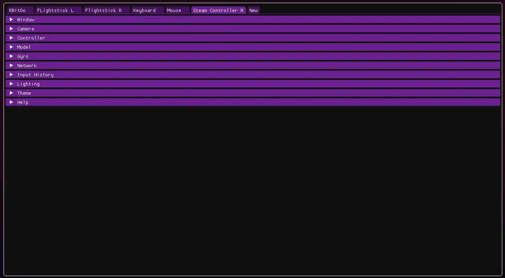
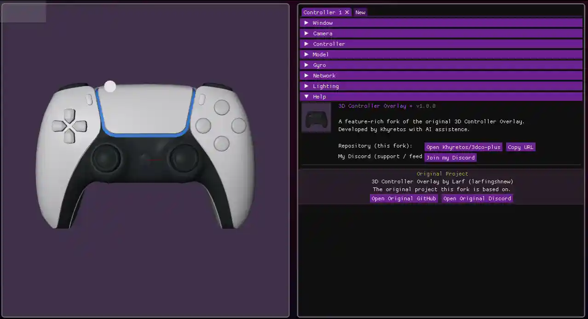
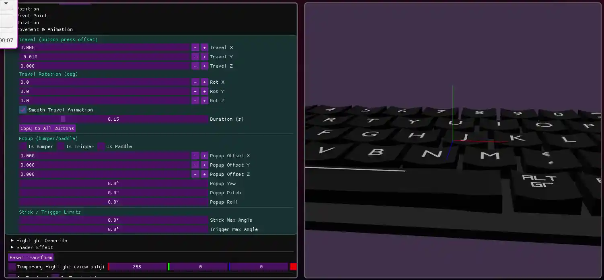
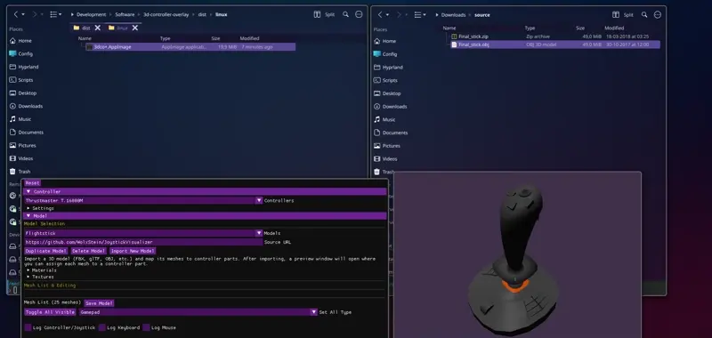
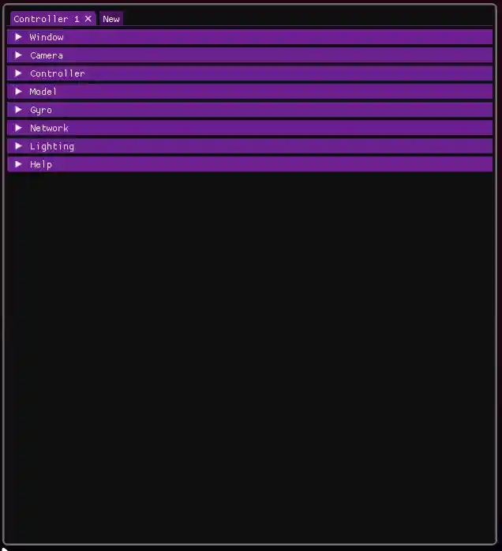
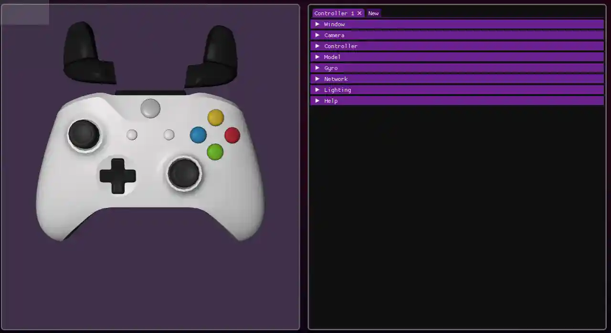
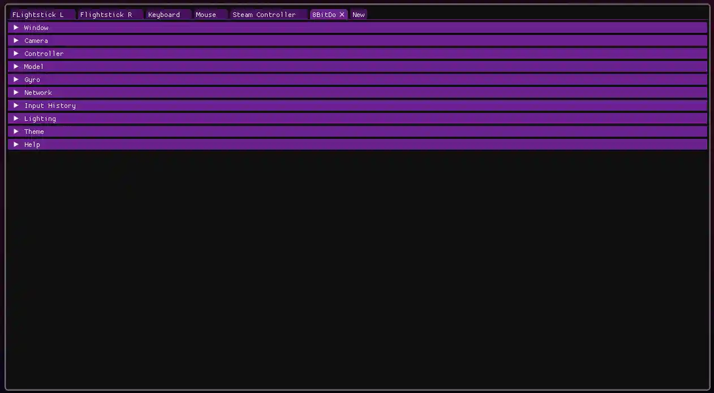

# 3D Controller Overlay — Instructions

## Table of Contents

1. [What's New in 1.3.0](#whats-new-in-130)
2. [What's New in 1.2.0](#whats-new-in-120)
3. [What's New in 1.1.1](#whats-new-in-111)
4. [What's New in 1.1.0](#whats-new-in-110)
5. [First Launch](#first-launch)
6. [Opening a Controller Window](#opening-a-controller-window)
7. [Mapping Inputs](#mapping-inputs)
8. [Gyro Support](#gyro-support)
9. [Touchpads](#touchpads)
10. [Highlighting & Press Feedback](#highlighting--press-feedback)
11. [Smooth Travel Animation](#smooth-travel-animation)
12. [Importing a Custom Model](#importing-a-custom-model)
13. [Textures & UV Mapping](#textures--uv-mapping)
14. [Materials](#materials)
15. [Lighting](#lighting)
16. [Window & Camera Settings](#window--camera-settings)
17. [Network Functionality](#network-functionality)
18. [Shader Effects](#shader-effects)
19. [Input History](#input-history)
20. [The Log Window](#the-log-window)
21. [Taskbar/Tray Icon & Debug Mode](#taskbartray-icon--debug-mode)
22. [Theme](#theme)
23. [Data Directory & Backups](#data-directory--backups)
24. [Troubleshooting](#troubleshooting)

---

## What's New in 1.3.0

Quick tour of what's new this release:

- [Textures & UV Mapping](#textures--uv-mapping) – four new texture types: **Normal Map**, **Metallic Map**, **Roughness Map**, and **AO Map**, alongside the existing Diffuse/Specular/Emissive.
- [Materials](#materials) – set a texture or material once at the model level instead of on every part, with a per-part override for anything that needs to be different.
- [Window & Camera Settings](#window--camera-settings) – a new right-click menu on controller windows (Reset View / Click-Through / Drag to Move), and Click-Through/Drag-to-Move shortcuts can now be bound to any keyboard key instead of a fixed short list.
- A new **Description** field for a model, alongside the existing Source URL — see [Importing a Custom Model](#importing-a-custom-model).
- A confirmation prompt now appears before quitting with unsaved changes, whether from Escape, closing a controller window, or the tray icon's Quit.
- Fixed: switching to a model whose own file doesn't set a Source URL or Description used to leave the previous model's value displayed instead of going blank.
- Fixed crashes when adding/removing textures, and GPU memory leaks around texture handling on window close and model switch.

---

## What's New in 1.2.0

Quick tour of what's new this release:

- [Input History](#input-history) – a separate always-on-top window per controller/keyboard/mouse showing recent presses, fighting-game-style. Raw text, ms/frame-annotated notation, or a fully data-driven set of icon packs you can also build your own versions of (see **Custom Glyph Mappings**) — plus gyro flick detection, per-trigger analog depth, and a persistent log file so you can scroll back through everything you pressed.
- [Textures & UV Mapping](#textures--uv-mapping) – new section explaining how texture mapping actually works, plus: texture assignments now actually save with the model (previously lost on reload), mesh loading warns about missing/degenerate UV data, clearer guidance when a `.blend` import fails, and Flip X/Y controls alongside the existing Offset/Scale/Rotation for source images that read mirrored on a mesh.
- Fixed: camera pan (Pan X/Y) wasn't saved and reset to center on every reload.
- Fixed: capturing an input for a Dual Highlight axis always produced a one-directional binding, so travel/rotation could only ever swing through half its range (e.g. 0–90° instead of -90–90°) regardless of which way you moved the stick. See [Dual Highlighting](#highlighting--press-feedback).
- Real compound-motion detection – quarter-circles, dragon-punch motions, half-circles, and full 360s are now actually recognized as you input them (previously, motion glyphs could only ever be assigned manually, never triggered by play). See Input History's Motion Timeout setting.
- New **Theme** section in Settings (just before Help) for customizing the app's accent colors, with a one-click reset - applies instantly everywhere, including Log/Glyph Mapping Editor/Input History windows, and saves like any other setting.
- Fixed: the main Settings window's scrollbar didn't appear when a section's content was taller than the window - content was there, just unreachable.
- Fixed: D-Pad presses showed up twice in Input History (both a direction digit/glyph and a separate button entry) for the same press.
- The Glyph Mapping Editor is now its own resizable window instead of embedded in Settings, and Input History windows support the same drag-to-move/scroll-to-resize controls as controller windows.

---

## What's New in 1.1.1

Quick tour of what's new this release:

- [Smooth Travel Animation](#smooth-travel-animation) – buttons and paddles can now ease into a press instead of snapping instantly, with a per-mesh toggle and duration, plus one-click Copy/Unassign across every button on the controller.
- Popup (bumper/paddle) offsets and Travel now stack instead of one silently disabling the other — a mesh flagged as a bumper/paddle with Popup enabled now still presses and travels normally.
- Fixed the Touch Area's Yaw/Pitch/Roll sliders only rotating a tiny fraction of the angle shown — they now match the displayed degrees exactly.
- Settings window polish: collapsible section headers ("Position", "Rotation", "Shader Effect", etc.) now have their own darker background tint, so the header reads as a distinct title bar instead of blending into the section above it.

---

## What's New in 1.1.0

Quick tour of what's new this release — see the linked section for each for the full how-to:

- [Network Functionality](#network-functionality) – send a window's live state to another instance of the app over UDP/TCP.
- [Shader Effects](#shader-effects) – rewritten Pixel Art, Toon, Aurora, Infernal, and Rainbow looks, a new Galaxy shader, a fully-replaced Black Hole effect, plus ShaderToy shader import with automatic channel-texture handling and a new **Add Resource** picker.
- [The Log Window](#the-log-window) – now a real always-on-top window, with copyable log lines.
- [Taskbar/Tray Icon & Debug Mode](#taskbartray-icon--debug-mode) – the tray icon now shows the app's own icon, and verbose logging is now opt-in via a new checkbox.
- Per-mesh **Visible** checkboxes (Mesh List) now save and reload with the model instead of resetting every time.
- A new, much smaller **Steam Controller 2026** model, and fixes for transparent-background compositing on AMD/NVIDIA and overlay performance under click-through.

---

## First Launch

On first launch, the app extracts its built‑in model library to your data directory – this takes a few seconds and only happens once.

**macOS users:** grant Accessibility permissions (see README) for keyboard/mouse overlay.

---

## Opening a Controller Window

From the Settings window, pick a model from your library and a connected controller. Each model corresponds to a specific controller layout with meshes pre‑assigned.

You can open multiple windows for multiple controllers simultaneously.

---

## Mapping Inputs

Every visible part (button, stick, trigger, touchpad) has an **input binding**. Select a mesh and either:

- **Capture mode:** press the physical button/key/click – the app detects it automatically.
- **Manual selection:** choose from a dropdown of all known inputs.

**Binding types:**

| Type     | Description                                                   |
| -------- | ------------------------------------------------------------- |
| Gamepad  | SDL’s standardised buttons, sticks, triggers, D‑pad.          |
| Joystick | Raw, unmapped button/axis/hat indices.                        |
| Keyboard | Any key, captured globally (even when overlay isn’t focused). |
| Mouse    | Buttons, movement, and scroll.                                |

Use the **Invert** checkbox to flip axis direction.

---

## Gyro Support

If your controller has a gyroscope, enable it per‑window:

- **Sensitivity** – rotation multiplier.
- **Correction** – drift correction strength.
- **Reset combo** – hold two buttons to snap gyro to neutral.
- **Debug logging** – logs raw Euler angles to the log window.

---

## Touchpads

Controllers with capacitive touchpads (Steam Controller, DualSense/DualShock) support up to 2 fingers per pad (up to 4 pads per window).

- Set **touch width/height** to match the physical area.
- Adjust **offset/rotation** to align the touch indicator.
- Touchpoint meshes are automatically parented to the touchpad.

Touchpoints that go idle for 5 seconds auto‑hide.

---

## Highlighting & Press Feedback

By default, pressing a button glows the mesh in a global highlight colour.  
**Per‑mesh override:** set a custom colour.

**Dual highlighting** (for axes) – different colours for positive/negative directions, with adjustable deadzone.

---

## Smooth Travel Animation

_(GIF coming soon)_

By default, a button's Travel (its press offset/rotation, set under **Movement & Animation**) snaps instantly between pressed and released. Smooth Travel Animation eases it instead, so a press reads as a smooth motion rather than a single-frame jump — the GIF above shows the same button with it off vs. on, side by side.

Per mesh, under **Movement & Animation**:

- **Smooth Travel Animation** – on/off.
- **Duration (s)** – roughly how long the press/release takes to settle once enabled. Lower is snappier, higher is softer/slower.
- **Copy to All Buttons** / **Unassign from All Buttons** – apply (or clear) the current enabled state and duration across every other button-type mesh on the controller in one click, instead of setting each one individually.

**Not available on sticks, triggers, or touchpads/touchpoints** – those track a live physical position every frame (how far a trigger is actually pulled, where a finger actually is on a touchpad right now), so easing them would make the rendered part visibly lag behind the real input instead of just looking like a nice animation. The control is hidden for those mesh types for exactly that reason; regular buttons, bumpers, and paddles are unaffected and can use it normally.

---

## Importing a Custom Model

You can bring in your own 3D model (common formats like FBX, glTF, OBJ, etc.) instead of using a built‑in one:

1. **Settings → Import Model**, pick your file.
2. A preview window opens listing every mesh found in the file.
3. For each mesh, assign it to a controller part (or leave unassigned to hide it), and optionally set a parent part for correct pivoting (e.g. a touch finger indicator parented to its touchpad).
4. Save — the app converts the imported meshes into a usable model and writes it to your model library.

**Source URL and Description:** once a model is loaded, the Model tab has a **Source URL** field (where it came from) and a **Description** field — a multi-line box for crediting the model's creator/contributors, leaving setup notes, or anything else worth keeping with it. Both save and load with the model itself and have no effect on how it looks or behaves.

> **⚠️ Important – your model must be separated into parts.**  
> For the app to properly highlight, animate, and map inputs to individual buttons, triggers, sticks, etc., your 3D model file **must contain each interactive element as a separate mesh**.  
> For example:
>
> - `A_button`, `B_button`, `X_button`, `Y_button` as individual meshes
> - `left_stick`, `right_stick` as separate meshes
> - `left_trigger`, `right_trigger` as separate meshes
> - `dpad_up`, `dpad_down`, `dpad_left`, `dpad_right` as individual pieces
>
> If you export a single unified mesh (e.g., the entire controller as one object), you **will not** be able to assign different inputs or highlight colours to different buttons – the whole model will behave as a single part.  
> **Tip:** Name your meshes clearly (e.g., `touchpad`, `left_bumper`, `start_button`) – the app will show these names in the assignment list, making it easier to map correctly.

---

## Textures & UV Mapping

_(Video coming soon)_

**How texture mapping works:** 3dco+ always uses the mesh's own UV coordinates — the standard `vt` texture-coordinate data from an OBJ file, or the equivalent channel from whatever format you imported (FBX, glTF, etc.). It never uses object-space, triplanar, or normal-based mapping. If a mesh already has a proper UV unwrap from whatever 3D tool you made or exported it in, a texture applied here will follow that unwrap exactly.

**Adding a texture to a mesh:**

1. Select the mesh in the Mesh List.
2. Open its **Materials/Textures** section and click **Add Texture**.
3. Pick an image file (PNG/JPG). It's added with a **Type**, plus **Offset**, **Scale**, and **Rotation** controls for fine-tuning how it sits on the UV unwrap.
4. Texture assignments save with the model (`info.json`) and reload correctly.

**Texture types:**

| Type          | What it does                                                                                                                                                         |
| ------------- | ---------------------------------------------------------------------------------------------------------------------------------------------------------------------|
| Diffuse       | The base color image.                                                                                                                                                |
| Specular      | Controls highlight intensity/color.                                                                                                                                  |
| Emissive      | Glows regardless of lighting.                                                                                                                                        |
| Normal Map    | Adds surface detail (bumps, grain, panel lines) without extra geometry. Use an image where flat areas are blue-purple (roughly RGB 128, 128, 255) — the standard format most 3D tools export. |
| Metallic Map  | Grayscale; brighter = more metallic.                                                                                                                                 |
| Roughness Map | Grayscale; brighter = softer/rougher reflections, darker = sharper/glossier.                                                                                        |
| AO Map        | Grayscale; darker = more occluded (crevices, contact points), brighter = more exposed to ambient light.                                                              |

Any of these can also be set once for the whole model instead of per part — see [Materials](#materials).

**If a texture looks wrong (smeared, one flat color, or not lining up):** this is almost always a property of the _mesh's own UV data_, not a setting in this app. The most common cause is a missing or degenerate UV unwrap — some export/optimization workflows drop or never generate one unless you explicitly tell the tool to preserve/create it. 3dco+ detects this automatically: if a loaded mesh has no meaningful UV variation, a warning appears in the [log](#the-log-window) explaining exactly that, rather than leaving you guessing whether it's a texture-mapping bug. Re-export the mesh with a proper UV unwrap (most 3D tools have a "UV unwrap" or "smart UV project" operation) to fix it.

**A note on `.blend` files specifically:** importing a `.blend` file directly is unreliable for many Blender files — this is a long-standing limitation in the underlying Assimp library's own Blender parser (not something specific to your file), and it can fail outright rather than producing a usable model. If a `.blend` import fails, export from Blender as **OBJ, FBX, or glTF** instead (File → Export in Blender) and import that — those formats are handled reliably and are what this app's own built-in models use.

---

## Materials

Set a texture or material property once at the model level instead of assigning it to every part by hand.

**Global Textures:**

1. In the Model tab, find the **Global Textures** section (above the per-part texture list).
2. Add a texture there the same way you would for a single part — pick a file, then set its **Type** (any of the types listed in [Textures & UV Mapping](#textures--uv-mapping) above).
3. It applies to every part that doesn't already have a texture of that same type. A part with its own texture of a given type always keeps using its own — the override is per type, so a part can use its own Diffuse while still inheriting a global Normal Map, for example.

**Global Material:**

1. Set the model's **Global Material** (ambient, diffuse, specular, shininess, color) once, in the Model tab.
2. For any part that needs different values, enable **Use Custom Material** on that part, then set its own ambient/diffuse/specular/shininess/color.

Neither of these is an all-or-nothing switch for the whole model — the override is always per part (and for textures, per texture type within that part).

---

## Lighting

Each window supports **directional**, **point**, and **spot** lights. Adjust ambient/diffuse/specular strength, colour, falloff (point/spot), and hide sources without deleting them.

---

## Window & Camera Settings

- **Always on top**, **borderless**, **drag to move**, **scroll to resize** – useful for clean overlays.
- **On Windows especially**: these windows have no title bar to drag by design, so if you need to reposition one, turn on **Drag to Move** first - otherwise dragging on the model does whatever its normal input binding does instead.
- **Camera**: distance, yaw, pitch, roll, and a **freelook** mode (WASD + mouse‑look).
- **Swap interval** (V‑Sync: off/on/adaptive) and background colour/opacity.

**Right-click menu:** right-click anywhere on a controller window for a quick menu — **Reset View**, **Enable/Disable Click-Through**, **Enable/Disable Drag to Move** — without opening Settings. Note that once Click-Through is on, clicks (including right-clicks) pass straight through the window to whatever's behind it, so the menu itself becomes unreachable that way — use a keyboard shortcut (below) to turn Click-Through back off in that case.

**Keyboard shortcuts for Click-Through/Drag to Move:**

1. In Settings, enable **Enable Shortcut Monitoring** (off by default, applies to every window on every platform once on).
2. On any window's Click-Through and/or Drag to Move dropdown, pick any keyboard key — not limited to a fixed list.
3. With monitoring on, holding that key toggles the setting from anywhere, without needing the window focused or hovered. If more than one window shares the same key, they react together when you press it.

---

## Network Functionality

Send a controller window's live state to another running instance of the app instead of only rendering it locally — useful for a two-PC setup where you want the overlay/capture happening on a machine other than the one generating input.

In a controller window's **Window** section:

1. Set **Mode** to `Sender` on the machine generating input, or `Receiver` on the machine that should display it.
2. Pick a **Protocol** — `UDP` for fast/connectionless (supports broadcast addresses), or `TCP` for a reliable one-to-one connection.
3. Enter a matching **IP Address** and **Port** on both ends (on the Sender, the IP is the Receiver's address).
4. Optionally lower **Send Rate** if you don't need the default rate.
5. Check **Enable Network** on both ends. A green status line confirms the connection.

A window in Receiver mode ignores local controller input entirely — everything it shows comes from the network.

---

## Shader Effects

Each mesh has a **Shader Effect** dropdown (and there's a global one per window) offering built-in looks: **Pixel Art**, **Cartoon** (cel-shaded/toon), **Aurora**, **Galaxy**, **Infernal**, **Rainbow**, and **Black Hole** (a swirling accretion disk, not a literal simulation) — plus support for pasting in your own ShaderToy-style shader.

**Bringing in your own ShaderToy shader:** most ShaderToy shaders (anything using `mainImage()`) work as-is — the app wraps them with the standard uniforms automatically. If a shader samples a channel texture (`iChannel0`-`iChannel3`):

- Click **Add Resource...** next to the shader dropdown to pick an image and assign it to the next free channel.
- Don't have a specific image in mind? Leave it — a channel with nothing assigned gets a generated noise texture instead of rendering black, which is enough for most shaders that just want "some noise" (very common for procedural effects).

Shader files live in your [data directory](#data-directory--backups), under `shaders/<name>/` — `fragment.glsl` plus any `channel0`–`channel3` image files, if you'd rather manage them by hand.

---

## Input History

_(Video coming soon)_

A separate always-on-top window per controller/keyboard/mouse window, showing a scrolling list of recent presses — the input-display style fighting games like Street Fighter and Tekken use, equally handy for tutorials. Toggle it per-window from that window's **Input History** section in Settings.

**Display style** (one dropdown, three families):

1. **Raw** – plain text labels.
2. **Fighting-Game Notation** – numpad direction digits (5 = neutral, 1-9 8-way) plus button labels.
3. **Icon packs** – Xbox 360/One/Series, PlayStation 3/4/5, Switch, Steam Deck, Keyboard & Mouse (Dark) or (Light), FGC Motion combined with either PS5 or Xbox — or a mapping you built yourself (see **Custom Glyph Mappings** below). A button a pack has no art for falls back to its text label.

**Capture**, all independent per window:

- **Gamepad/Joystick, Keyboard, Mouse** – which device types this window records, independent of what's bound to the model's meshes.
- **Gyro (Flicks)** – logs a fast, deliberate rotation ("Left Flick", "Up Flick", etc.) rather than every small motion, which would flood the history. Two thresholds control this: **Motion Sensitivity** filters out slow drift/tremor entirely, and **Flick Threshold** is how much rotation has to accumulate (within the **Flick Window**) to count as one flick, with a **Flick Cooldown** so a single continued motion doesn't spam repeated entries. Requires Gyro enabled for this window (see [Gyro Support](#gyro-support)).
- **Merge Simultaneous Presses** – groups inputs landing within **Simultaneous Window (ms)** of each other (default 50ms, adjustable) into one entry (`A+B`). Matters for fighting games; leave off for a clean one-input-per-line list otherwise.
- **Show Return to Neutral** – off by default: letting go of the stick/D-pad doesn't log its own entry, only the direction that actually mattered does. Turn on to log every return to center too.
- **Motion Timeout** – how much time a compound motion (quarter-circle, dragon punch, 360, etc.) has to complete, calibrated to a 2-step quarter-circle (236/214) - longer motions automatically get proportionally more time. Default (220ms) sits close to Street Fighter 6's own quarter-circle window; the setting's own tooltip compares it against Tekken 8 and Guilty Gear Strive too. Motions are actually detected during play now, not just displayable via manual glyph mapping.

**Timing** – an independent **Show Input Timing** toggle (works with any display style, not just Notation) adds a Timing column showing milliseconds or frames (60fps reference) since the previous input. A gap longer than **Reset After** doesn't count as measured timing — it just means you paused — and shows as `--` instead of a misleading number. **Show Date/Time** adds a separate leftmost column with the real wall-clock time each entry was captured.

**Triggers** analog depth is shown as a percentage next to the icon (e.g. `RT 67%`); **Trigger Press Threshold** sets how far a trigger needs to be pulled to register at all.

**Appearance:** independent **Background Opacity** and **Content Opacity** (so a mostly-transparent background can still have fully-opaque icons, or vice versa), **Glyph Size** and **Font Size** (the latter now applies to every column - Time/Input/Timing - not just Raw/Notation text), **Alternating Row Colors** (on by default - turn off alongside 0% Background Opacity for a fully transparent window showing only glyphs/text), **Newest Entry On Top** (or bottom, scrolling like a terminal), **Click-Through**, and **Drag to Move**/**Scroll to Resize** (same controls as a controller window's own, only active while Click-Through is off).

**Log to File** writes every captured input to its own timestamped file under `input_history_logs/` in your [data directory](#data-directory--backups) — independent of the live window's history length, so you can review exactly what you pressed after the fact (checking a speedrun attempt frame by frame, for example).

### Custom Glyph Mappings

Build your own icon set instead of (or alongside) the bundled ones, in its own window — works the same way as mapping a custom controller model:

1. In the Display Style area, click **New Glyph Mapping...** and enter a name, or pick **Edit Existing Mapping** to modify one of the bundled styles (or one you made earlier) — this opens the Glyph Mapping Editor in its own window, separate from Settings.
2. An empty table appears. Click **Add Row** for each input you want to map: choose its type (Gamepad Button, D-Pad Direction, Gamepad Motion, Trigger, Keyboard, or Mouse), the specific input, then **Browse...** (the last column) to assign an image — either an existing glyph from the `glyphs/` folder or your own picture, which gets automatically converted and resized. **Gamepad Motion** is a fixed dropdown of the compound sequences the bundled FGC Motion art has icons for (`236`, `623`, `360`, and similar) — worth being clear-eyed about what this is: there's no actual runtime detection of a player performing a multi-direction motion to match against, so this only lets you assign a glyph to one of those known strings for whatever other use, not a claim the app recognizes them during play.
3. Optionally set **Combine With** to another style, so anything you don't define yourself falls back to that style's glyphs instead of a bare text label — a mapping can also exclude specific input types from that fallback (FGC Motion does this for D-Pad glyphs, since it already represents direction its own way).
4. **Save Mapping** — it's written to its own folder under `glyphs/` and immediately shows up as a Display Style choice, for any window. If a standard bundled style's folder ever goes missing (deleted by accident, an interrupted install), it's silently restored from the bundled pack the next time you launch.

---

## The Log Window

**Settings → Open Log Window** opens the log in its own always-on-top window (previously it lived inside the Settings window and could get sent behind it — that's fixed). The same log is also written to `logs/` in your data directory (rotated at 5 MB, 3 files kept).

Log lines are copyable: click-drag to select text like any other text field, use Ctrl+C, or just click **Copy All** to grab everything currently shown.

---

## Taskbar/Tray Icon & Debug Mode

Next to each other in a controller window's **Window** section:

- **Enable Taskbar Icon** – adds a system tray icon (Windows and Linux) showing the app's own icon. Click it to minimize/restore the main window; right-click for a menu with per-controller minimize/restore, network status, and Quit. Not yet available on macOS.
- **Enable Debug Mode** – turns on more verbose diagnostic logging (e.g. a line per mesh loaded). Off by default, since it adds a small delay when loading models with a lot of parts — turn it on before opening the Log Window if you're reporting a bug.

---

## Theme

A Settings section of its own (just before Help) for customizing the three accent colors used everywhere in the app - buttons, section headers, sliders, active tabs, and input field backgrounds, across Settings and every window it opens (Log, Glyph Mapping Editor, Input History):

- **Primary** – the main accent color: buttons, section headers, sliders, active tabs.
- **Primary (Light)** – hover/highlighted states.
- **Primary (Dark)** – pressed/active states and input field backgrounds.
- **Reset to Default** – one click back to the shipped purple scheme.

Changes apply immediately, everywhere, not just in Settings - open a controller window's Input History or the Glyph Mapping Editor while adjusting a color and it updates live. Saved the same way as every other setting, this is app-wide rather than per-window (there's only one theme, not one per controller tab).

---

## Data Directory & Backups

Everything you configure – bindings, imported models, tab layouts, controller mapping database – lives in your per‑OS data directory (see README for paths). Back it up to preserve your setup.

---

## Troubleshooting

- **Keyboard/mouse bindings don’t work (macOS):** grant Accessibility permissions (see README).
- **Controller shows up but buttons are unlabeled:** not in SDL’s gamepad database. Use manual mapping with raw Joystick bindings, or add an entry to `gamecontrollerdb.txt` in the data directory.
- **Gyro crashes or misbehaves on Windows:** open an issue with controller model and log contents.
- **First launch is slow:** expected – extracting the embedded model library. Subsequent launches are fast.
- **Grid not visible:** ensure “Show Grid” is checked and camera distance is not too far. The grid is now smaller and positioned below the model.
- **A "quit anyway / cancel" prompt appeared:** expected behavior, not a bug — you have unsaved changes, and this appears before Escape, closing a controller window, or the tray icon's Quit actually exits, so an accidental close doesn't silently discard them. Save first, or pick Quit Anyway to discard the changes on purpose.
