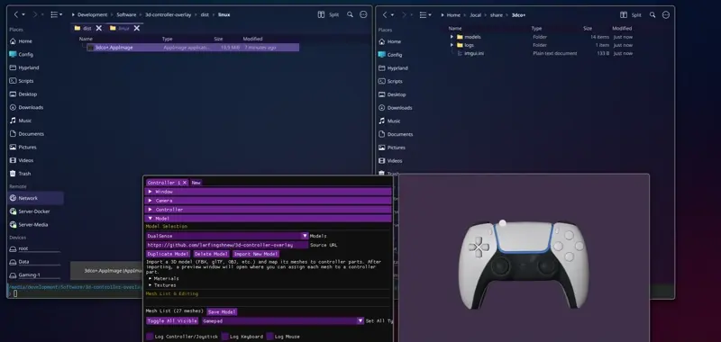
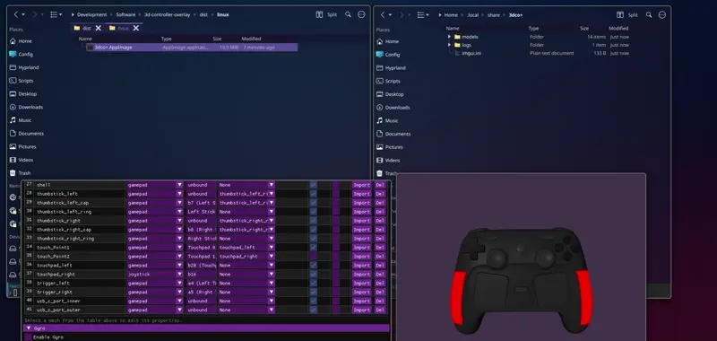
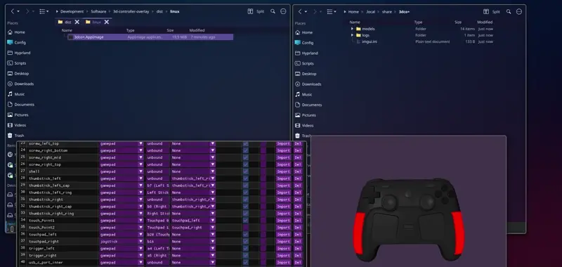
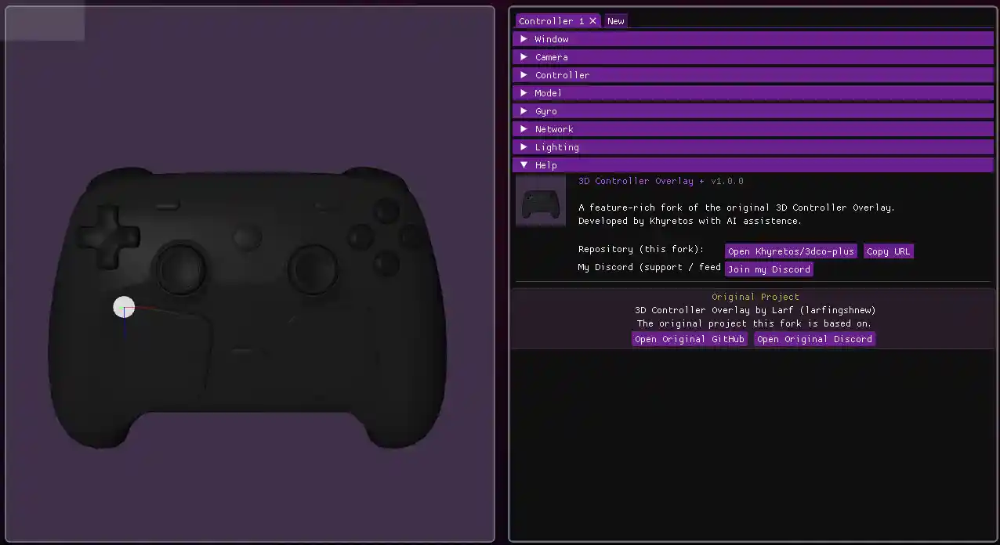
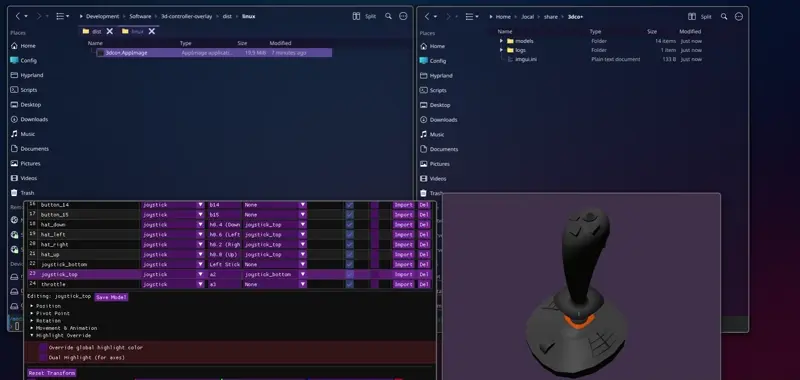
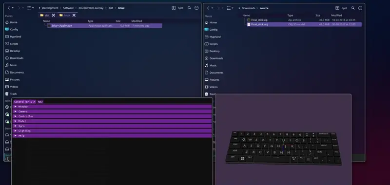
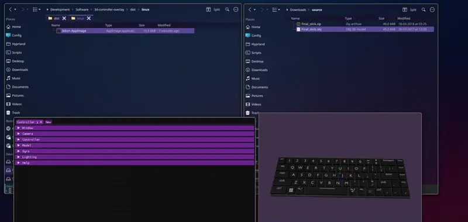

# 3D Controller Overlay — Instructions

## Table of Contents

1. [First Launch](#first-launch)
2. [Opening a Controller Window](#opening-a-controller-window)
3. [Mapping Inputs](#mapping-inputs)
4. [Gyro Support](#gyro-support)
5. [Touchpads](#touchpads)
6. [Highlighting & Press Feedback](#highlighting--press-feedback)
7. [Importing a Custom Model](#importing-a-custom-model)
8. [Lighting](#lighting)
9. [Window & Camera Settings](#window--camera-settings)
10. [The Log Window](#the-log-window)
11. [Data Directory & Backups](#data-directory--backups)
12. [Troubleshooting](#troubleshooting)

---

## First Launch

On first launch, the app extracts its built‑in model library to your data directory – this takes a few seconds and only happens once.

**macOS users:** grant Accessibility permissions (see README) for keyboard/mouse overlay.

---

## Opening a Controller Window

From the Settings window, pick a model from your library and a connected controller. Each model corresponds to a specific controller layout with meshes pre‑assigned.

You can open multiple windows for multiple controllers simultaneously.

---

## Mapping Inputs

Every visible part (button, stick, trigger, touchpad) has an **input binding**. Select a mesh and either:

- **Capture mode:** press the physical button/key/click – the app detects it automatically.
- **Manual selection:** choose from a dropdown of all known inputs.

**Binding types:**

| Type     | Description                                                   |
| -------- | ------------------------------------------------------------- |
| Gamepad  | SDL’s standardised buttons, sticks, triggers, D‑pad.          |
| Joystick | Raw, unmapped button/axis/hat indices.                        |
| Keyboard | Any key, captured globally (even when overlay isn’t focused). |
| Mouse    | Buttons, movement, and scroll.                                |

Use the **Invert** checkbox to flip axis direction.

---

## Gyro Support

If your controller has a gyroscope, enable it per‑window:

- **Sensitivity** – rotation multiplier.
- **Correction** – drift correction strength.
- **Reset combo** – hold two buttons to snap gyro to neutral.
- **Debug logging** – logs raw Euler angles to the log window.

---

## Touchpads

Controllers with capacitive touchpads (Steam Controller, DualSense/DualShock) support up to 2 fingers per pad (up to 4 pads per window).

- Set **touch width/height** to match the physical area.
- Adjust **offset/rotation** to align the touch indicator.
- Touchpoint meshes are automatically parented to the touchpad.

Touchpoints that go idle for 5 seconds auto‑hide.

---

## Highlighting & Press Feedback

By default, pressing a button glows the mesh in a global highlight colour.  
**Per‑mesh override:** set a custom colour.

**Dual highlighting** (for axes) – different colours for positive/negative directions, with adjustable deadzone.

---

## Importing a Custom Model

You can bring in your own 3D model (common formats like FBX, glTF, OBJ, etc.) instead of using a built‑in one:

1. **Settings → Import Model**, pick your file.
2. A preview window opens listing every mesh found in the file.
3. For each mesh, assign it to a controller part (or leave unassigned to hide it), and optionally set a parent part for correct pivoting (e.g. a touch finger indicator parented to its touchpad).
4. Save — the app converts the imported meshes into a usable model and writes it to your model library.

> **⚠️ Important – your model must be separated into parts.**  
> For the app to properly highlight, animate, and map inputs to individual buttons, triggers, sticks, etc., your 3D model file **must contain each interactive element as a separate mesh**.  
> For example:
>
> - `A_button`, `B_button`, `X_button`, `Y_button` as individual meshes
> - `left_stick`, `right_stick` as separate meshes
> - `left_trigger`, `right_trigger` as separate meshes
> - `dpad_up`, `dpad_down`, `dpad_left`, `dpad_right` as individual pieces
>
> If you export a single unified mesh (e.g., the entire controller as one object), you **will not** be able to assign different inputs or highlight colours to different buttons – the whole model will behave as a single part.  
> **Tip:** Name your meshes clearly (e.g., `touchpad`, `left_bumper`, `start_button`) – the app will show these names in the assignment list, making it easier to map correctly.

---

## Lighting

Each window supports **directional**, **point**, and **spot** lights. Adjust ambient/diffuse/specular strength, colour, falloff (point/spot), and hide sources without deleting them.

---

## Window & Camera Settings

- **Always on top**, **borderless**, **drag to move**, **scroll to resize** – useful for clean overlays.
- **Camera**: distance, yaw, pitch, roll, and a **freelook** mode (WASD + mouse‑look).
- **Swap interval** (V‑Sync: off/on/adaptive) and background colour/opacity.

---

## The Log Window

**Settings → Open Log Window** shows a live, colour‑coded log inside the app.  
The same log is also written to `logs/` in your data directory (rotated at 5 MB, 3 files kept).

---

## Data Directory & Backups

Everything you configure – bindings, imported models, tab layouts, controller mapping database – lives in your per‑OS data directory (see README for paths). Back it up to preserve your setup.

---

## Troubleshooting

- **Keyboard/mouse bindings don’t work (macOS):** grant Accessibility permissions (see README).
- **Controller shows up but buttons are unlabeled:** not in SDL’s gamepad database. Use manual mapping with raw Joystick bindings, or add an entry to `gamecontrollerdb.txt` in the data directory.
- **Gyro crashes or misbehaves on Windows:** open an issue with controller model and log contents.
- **First launch is slow:** expected – extracting the embedded model library. Subsequent launches are fast.
- **Grid not visible:** ensure “Show Grid” is checked and camera distance is not too far. The grid is now smaller and positioned below the model.
