# 3D Controller Overlay +

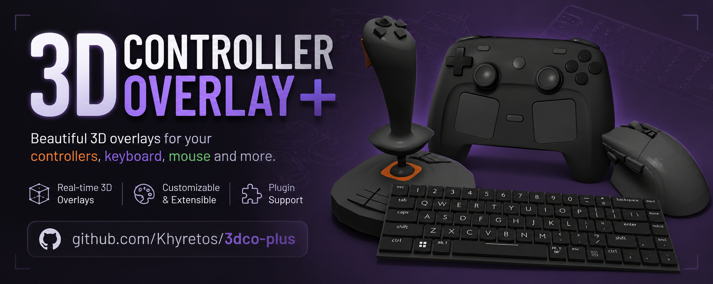

> ⚠️ **AI-assisted project — read before you judge the code.**
> This fork is built with heavy use of AI coding assistance. That does **not** mean "vibe coded and shipped blind." Every architectural decision — how input flows from SDL into the mesh hierarchy, how the settings/import system is structured, what gets a raw joystick fallback vs. a GameController mapping, how the build/packaging pipeline is put together — was made, reviewed, and debugged by me. AI was the tool; the design, the testing, and the responsibility for what ships are mine. I'm building this openly as a way to test how far I can push my own skills with AI as a collaborator, not to hide behind it. If you find something that looks wrong, please open an issue — I'd genuinely rather know.

**3D Controller Overlay +** (`3dco+`) is an AI-assisted continuation of [**3D Controller Overlay**](https://github.com/larfingshnew/3d-controller-overlay) by **Larf** ([larfingshnew](https://github.com/larfingshnew)). It's a lightweight OpenGL/SDL3 program that renders a live 3D model of your input device — buttons, sticks, triggers, touchpads, keys, gyro/accel — so content creators can show what their controller, keyboard, or mouse is doing without a handcam.

This project is a **fork, not a replacement**. It exists as an homage to the original tool and its creator, rebuilt on top of the same rendering foundation but pushed further. All credit for the original concept, models, and engine goes to Larf. If you just want the classic, minimal version, go use [the original repo](https://github.com/larfingshnew/3d-controller-overlay) — it's great on its own.

The **`+`** in the name means exactly that: **improvements and extra features** layered on top of the original — more controllers, more rendering features, more input paths, more build tooling — while keeping the same "point it at your input device and it just works" spirit. It's also a personal passion project: a way for me to see what I'm actually capable of building and maintaining with AI as a collaborator rather than a crutch.

---

## Table of contents

- [What stayed the same](#what-stayed-the-same)
- [What's new in the `+`](#whats-new-in-the-)
- [How it works](#how-it-works)
- [Supported platforms](#supported-platforms)
- [Platform showcase](#platform-showcase)
- [Where your data lives](#where-your-data-lives)
- [Supported input](#supported-input)
- [Manual mapping for unrecognized devices](#manual-mapping-for-unrecognized-devices)
- [A couple of things you'll notice](#a-couple-of-things-youll-notice)
- [Controller showcase](#controller-showcase)
- [Work in progress / known bugs](#work-in-progress--known-bugs)
- [Building](#building)
- [Credits](#credits)

---

## What stayed the same

- **Core concept**: an OpenGL scene per connected input device, with each button/stick/trigger/key mapped to its own mesh piece that moves, presses, or lights up in real time.
- **Rendering stack**: GLFW + glad (OpenGL loader) + SDL3 + GLM (math) + Dear ImGui (the settings UI).
- **Model format**: parts are still individual `.obj` meshes, assembled per-device from a swappable model library.
- **Directional/point/spot lighting system** and the customizable grid floor.
- **Cross-platform target**: Windows, Linux, and macOS.

## What's new in the `+`

The goal of the `+` fork isn't "more lines of code" — it's closing gaps the original left open and adding the features a streamer/content-creator setup actually needs. Here's what that looks like in practice:

### Rendering & customization

- **Custom model import via Assimp.** You're no longer limited to the built-in controller library — import your own mesh (glTF, FBX, and anything else Assimp reads) and map its parts to buttons/axes through an import-preview/assignment workflow.
- **Pivot-point editing.** Reposition individual mesh pieces by dragging their pivot directly in the 3D viewport, instead of only editing raw offsets in a settings panel.
- **Per-part material alpha (transparency).**
- **Mouse orbit & zoom** for the camera, plus a dedicated **freelook** mode independent from the input-driven camera, with adjustable move/turn/mouse sensitivity.
- **Global and per-button "press" highlight colors**, with original-color tracking so highlighted parts revert correctly.
- **Touch-area visualization**: a drawable wireframe/fill overlay showing the real hit-area of touchpads, useful when lining up custom pads.
- **Multi-touchpad support**: up to 4 touchpads × 2 fingers each, versus the original's single pad.

### Input

- **Keyboard overlay.** A system-wide keyboard monitor (native backend per platform — see [Supported platforms](#supported-platforms)) drives a live on-screen keyboard, so keypresses show up even when another window has focus.
- **Mouse overlay.** The same system-wide backend tracks cursor position, buttons, and scroll wheel for a live mouse overlay.
- **Raw joystick fallback.** In addition to SDL3's `GameController` API (used for recognized/mapped pads), the `+` fork can open a device as a raw `SDL_Joystick`, so unmapped or unusual controllers still produce usable input instead of being ignored.
- **Per-axis/button mapping inversion**, so a stick or trigger that reads backwards on your hardware can be flipped without a new SDL mapping.
- **Gyro & accelerometer improvements**: dedicated sensitivity/correction settings, a configurable reset-gyro button combo, and optional debug logging of raw sensor data.

### Engineering / tooling

- **Structured logging via spdlog**, including rotating log files — the original had no structured logging at all.
- **CMake-based build system** replacing the original's platform-specific shell/batch scripts, plus convenience scripts (`build-all.sh`, `build-appimage.sh`, `build-macos.sh`, `build-windows.sh`) and Docker-based cross-build files for reproducible packaging.
- **AppImage & `.desktop` integration** on Linux for proper application-menu installation.
- **Embedded model library**: the bundled `.obj` model set is packed into the binary at build time and extracted on first run, so there's no separate assets folder to lose track of.
- **Updated to the latest Dear ImGui version** for improved UI/UX and bug fixes.
- **Updated to SDL3** for better performance, new features, and improved controller support.

New dependencies to support the above: **Assimp** (model import), **spdlog/fmt** (logging), and **nlohmann_json** (settings/model metadata), alongside the original GLFW/SDL3/GLM/stb stack.

## How it works

At a high level, the pipeline builds on the original:

1. **SDL3** enumerates connected controllers/joysticks and streams button, axis, hat, touchpad, and sensor (gyro/accel) events. A platform-native background thread separately watches the system keyboard and mouse (see [Supported platforms](#supported-platforms)), so those work even without window focus.
2. Each connected device gets its own **GLFW window** and OpenGL context, rendering a 3D scene built from that device's `.obj` parts.
3. Every frame, input state is mapped onto the corresponding mesh: buttons translate along their press axis and/or change color, sticks and triggers rotate/translate proportionally to their live analog value, touchpad finger positions move small touch-point meshes across the pad mesh, and keyboard/mouse events drive the keyboard/mouse overlay meshes the same way.
4. **Dear ImGui** drives the settings window — lighting, camera, colors, mappings, model import/mapping, and window behavior (always-on-top, borderless, click-through/drag-to-move, background color/alpha for green-screen or transparent capture).
5. The pipeline also accepts **raw joystick input** (for devices SDL3 doesn't have a built-in mapping for) and **imported custom meshes** (via Assimp) instead of only the bundled `.obj` library, with an added pivot/highlight/touch-area layer for fine-tuning how everything looks on stream.

## Supported platforms

All three major desktop platforms are targeted and built for:

| Platform   | Status                         | Notes                                                                                                                                                                                                                          |
| ---------- | ------------------------------ | ------------------------------------------------------------------------------------------------------------------------------------------------------------------------------------------------------------------------------ |
| 🐧 Linux   | ✅ Actively developed & tested | Primary development platform. Keyboard/mouse overlay uses raw `evdev` device polling.                                                                                                                                          |
| 🪟 Windows | ✅ Supported                   | Keyboard/mouse overlay uses a low-level `WH_KEYBOARD_LL` / `WH_MOUSE_LL` hook. Built via CMake + MSYS2/MinGW, or cross-compiled from Linux with the included Docker scripts.                                                   |
| 🍎 macOS   | ✅ Supported                   | Keyboard/mouse overlay uses a listen-only `CGEventTap` (requires granting Accessibility/Input Monitoring permission on first run). Built natively via Homebrew, or cross-compiled from Linux with the included Docker scripts. |

Since day-to-day development happens on Linux, the Windows and macOS builds get comparatively less mileage. If you hit a platform-specific issue on Windows or macOS, please file an issue with your OS version and build method — those reports genuinely help.

## Platform showcase

The same live overlay, running natively on all three targets.

| Platform       | Preview                         |
| -------------- | ------------------------------- |
| 🐧 **Linux**   |      |
| 🪟 **Windows** | 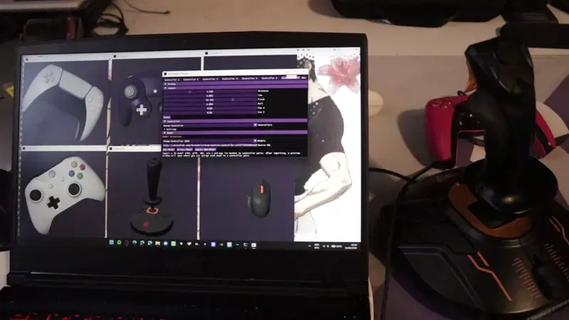 |
| 🍎 **macOS**   | 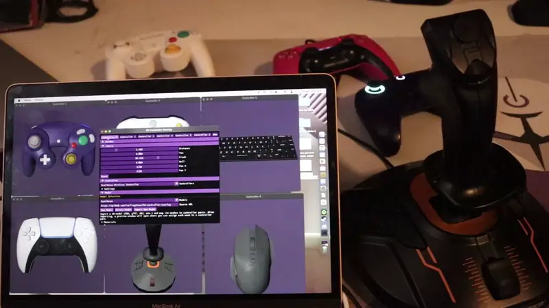     |

## Where your data lives

`3dco+` keeps all of its writable data — settings, imported models, the extracted model library, logs, and the controller mapping database — in a single per-user config directory, not next to the executable:

| Platform   | Location                               |
| ---------- | -------------------------------------- |
| 🐧 Linux   | `~/.local/share/3dco+/`                |
| 🪟 Windows | `%APPDATA%\3dco+\`                     |
| 🍎 macOS   | `~/Library/Application Support/3dco+/` |

You can jump straight there from inside the app via **Settings → Open Data Directory**. There's also an **Open Log Window** button right next to it if you'd rather watch the log live instead of digging through files — handy on macOS/Linux, where no console is attached to the process unless you launched it from a terminal.

## Supported input

| Input type                                                                         | Status                                                                       |
| ---------------------------------------------------------------------------------- | ---------------------------------------------------------------------------- |
| Standard gamepads (Xbox, DualShock/DualSense, Switch Pro, Joy-Con, GameCube, etc.) | ✅ Supported (via SDL3 GameController)                                       |
| Unmapped/generic joysticks                                                         | ✅ Supported (via raw SDL3 Joystick fallback)                                |
| Steam Controller                                                                   | ✅ Supported (detected natively with SDL3),Limited on macOS (see note below) |
| Keyboard overlay                                                                   | ✅ Supported (system-wide, works without window focus)                       |
| Mouse overlay                                                                      | ✅ Supported (position, buttons, scroll — system-wide)                       |
| Gyro / accelerometer                                                               | ✅ Supported, with sensitivity/correction tuning                             |
| Touchpads (DualShock/DualSense)                                                    | ✅ Supported, multi-touch, multiple pads                                     |
| Racing wheel / flightstick                                                         | 🚧 Work in progress                                                          |

Gamepad button/axis layouts are resolved through SDL3's community-maintained [`gamecontrollerdb.txt`](https://github.com/mdqinc/SDL_GameControllerDB) database (embedded in the app, covering most Xbox/PlayStation/Switch Pro/Steam Controller/third-party pads). If your controller shows up as a raw, unlabeled joystick instead of a named gamepad, it isn't in that database yet — you can either add an entry to `gamecontrollerdb.txt` in your [data directory](#where-your-data-lives) (e.g. using [SDL3 Gamepad Tool](https://generalarcade.com/gamepadtool/)) and restart, or just map it manually using raw joystick bindings in the Mapping panel, which works regardless of whether SDL3 recognizes the controller. If you do get a new controller working, consider [contributing the mapping upstream](https://github.com/mdqinc/SDL_GameControllerDB) so other SDL3-based apps benefit too.

**Note on Steam Controller support:** With the upgrade to SDL3, the Steam Controller is now detected and works directly on all supported platforms (Windows and Linux) without requiring any special workarounds. This is a significant improvement over the SDL2 version, where manual intervention was often needed. I am still looking into how to make it work in macOS.

## Manual mapping for unrecognized devices

If your controller or input device isn't automatically detected, you can manually map its buttons and axes using the **Mapping** panel in the settings window. Here's how:

1. **Enable Joystick Debugging** – Check the `Log Controller/Joystick` checkbox in the settings UI. This will print raw input values to the log (visible in the Log Window or the log file).
2. **Identify Your Device** – Open the `Controllers` dropdown in the `Controller` section and select your device. It will appear as either a named gamepad (if SDL3 recognizes it) or as a generic joystick.
3. **Map Buttons** – For each mesh (button, trigger, stick, etc.) in the **Mesh List**, set the `Input` column to the correct binding. You can either:
   - Use the dropdown to select a pre-defined input (e.g., `b0` for button 0, `a1+` for axis 1 positive direction), or
   - Click the dropdown and then press the button or move the axis you want to bind — the app will auto-capture it (when the dropdown is open, the app listens for input from that device).
4. **Test Your Mapping** – Once mapped, the mesh should respond to your input in the 3D view. Use the `Log Controller/Joystick` checkbox to verify that the values being read match what you expect.

For more complex devices (like flightsticks or racing wheels), you may need to experiment with axis directions, deadzones, and inversion settings. The `Log Controller/Joystick` checkbox is your best friend for diagnosing what your device is actually sending.

## A couple of things you'll notice

- **The download is a bit bigger than you might expect.** The full built-in model library ships embedded in the binary (see "Embedded model library" above) so the app works out of the box with zero setup and no separate assets folder to lose track of — that's most of what you're seeing in the file size, not bloat.
- **The first launch takes a few seconds longer.** Because that model library is compressed inside the binary, first run needs to unzip it into your [data directory](#where-your-data-lives) before it can use it. One-time cost — every launch after that is fast.

## Controller showcase

Live demo clips for every controller in the built-in model library. (The `+` badge on `3dco+` itself is a nod to this: everything below is an addition on top of what the original project shipped with.)
| Controller 1 | Controller 2 |
| -------------------------------------------------------------------------------------- | -------------------------------------------------------------- |
| **Steam Controller 2026**<br>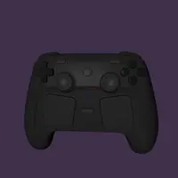 | **DualSense**<br>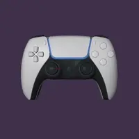 |
| **DualShock 4**<br>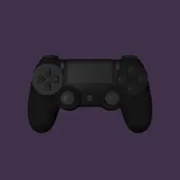 | **GameCube**<br> |
| **Joy-Con Grip**<br>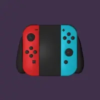 | **Keyboard**<br>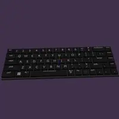 |
| **Left Joy-Con**<br> | **Right Joy-Con**<br>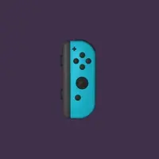 |
| **Xbox One**<br>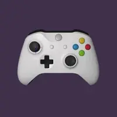 | **Xbox 360**<br>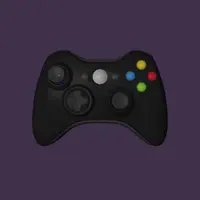 |
| **Mouse**<br>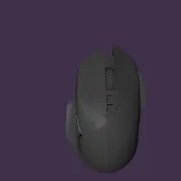 | **Switch Pro**<br>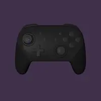 |
| **Wavebird**<br>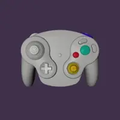 | **Flightstick**<br>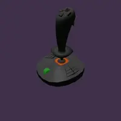 |

## Work in progress / known bugs

- **Racing wheel / flightstick support** — planned for pedal/wheel/stick/force-feedback devices; not yet in the model library or input path.
- **Windows/macOS coverage** — both platforms build and run, but get less real-world testing than Linux. Expect the occasional platform-specific rough edge.
- General stability/edge-case bugs from the expanded input and import paths are still being ironed out. Please file issues with repro steps if you hit one.

## Building

This fork builds with **CMake** and **pkg-config** on all three platforms. From the repo root:

### 🐧 Linux

```bash
# Debian/Ubuntu
sudo apt install build-essential cmake pkg-config libglfw3-dev libsdl3-dev \
  libassimp-dev libspdlog-dev libfmt-dev nlohmann-json3-dev

# Arch/CachyOS
sudo pacman -S --needed base-devel cmake pkgconf glfw sdl3 assimp spdlog fmt nlohmann-json

rm -rf build && mkdir build && cd build
cmake ..
make -j$(nproc)
```

### 🍎 macOS

```bash
brew install cmake pkg-config glfw sdl3 assimp spdlog fmt nlohmann-json

rm -rf build && mkdir build && cd build
cmake ..
make -j$(sysctl -n hw.ncpu)
```

**Enabling the keyboard/mouse overlay:** on first launch, macOS won't grant the global keyboard/mouse hook access automatically. To turn it on:

1. Open **System Settings → Privacy & Security → Accessibility**.
2. Click **+** and add **3D Controller Overlay +** (or your terminal, if you're running it from one).
3. Toggle it **on**, then restart the app.

If you skip this, the app still launches fine — gamepad/joystick input is unaffected — but keyboard/mouse bindings and the keyboard/mouse overlay simply won't register anything.

**"Apple could not verify this app":** I don't currently have an Apple Developer account, so prebuilt macOS releases aren't code-signed or notarized — that's a cost thing on my end, not a comment on safety, and Gatekeeper flags _any_ unsigned app this way. To open it the first time: **right-click (or Control-click) the app in Finder → Open**, rather than double-clicking, then click **Open** again on the warning dialog. macOS remembers your choice after that, and double-clicking works normally from then on. If you'd rather not take that on faith, the source is fully public here and you're welcome to build it yourself instead — see below.

### 🪟 Windows (native, via MSYS2/MinGW)

```bash
# Inside an MSYS2 MinGW64 shell
pacman -S --needed mingw-w64-x86_64-toolchain mingw-w64-x86_64-cmake \
  mingw-w64-x86_64-pkgconf mingw-w64-x86_64-glfw mingw-w64-x86_64-SDL2 \
  mingw-w64-x86_64-assimp mingw-w64-x86_64-spdlog mingw-w64-x86_64-fmt \
  mingw-w64-x86_64-nlohmann-json

rm -rf build && mkdir build && cd build
cmake -G "MinGW Makefiles" ..
mingw32-make -j$(nproc)
```

The resulting executable is **`3dco+`** (`3dco+.exe` on Windows).

Convenience scripts (`build-all.sh`, `build-appimage.sh`, `build-macos.sh`, `build-windows.sh`) plus Docker cross-build files are also included, and are the easiest way to produce a Windows or macOS build from a Linux machine without installing a full native toolchain.

## Credits

- **Original creator & engine**: [Larf](https://github.com/larfingshnew) — [3D Controller Overlay](https://github.com/larfingshnew/3d-controller-overlay). Please go star/support the original.
- **This fork**: designed, built, and maintained by me as a homage/continuation and a personal test of what I can build with AI-assisted coding — all architecture, debugging, and feature decisions are mine.
- Third-party libraries: GLFW, glad, SDL2, GLM, Dear ImGui, stb_image, Assimp, spdlog/fmt, nlohmann_json, miniz.
