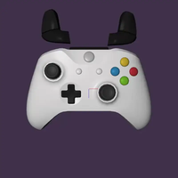

# 3D Controller Overlay +


> ⚠️ **AI-assisted project — read before you judge the code.**
> This fork is built with heavy use of AI coding assistance. That does **not** mean "vibe coded and shipped blind." Every architectural decision — how input flows from SDL into the mesh hierarchy, how the settings/import system is structured, what gets a raw joystick fallback vs. a GameController mapping, how the build/packaging pipeline is put together — was made, reviewed, and debugged by me. AI was the tool; the design, the testing, and the responsibility for what ships are mine. I'm building this openly as a way to test how far I can push my own skills with AI as a collaborator, not to hide behind it. If you find something that looks wrong, please open an issue — I'd genuinely rather know.

**3D Controller Overlay +** (`3dco+`) is an AI‑assisted continuation of [**3D Controller Overlay**](https://github.com/larfingshnew/3d-controller-overlay) by **Larf**. It renders a live 3D model of your input device — buttons, sticks, triggers, touchpads, keys, gyro/accel — so content creators can show their controller, keyboard, or mouse in action without a handcam.

This is a **fork, not a replacement**. It exists as an homage to the original tool and its creator, rebuilt on top of the same rendering foundation but pushed further. All credit for the original concept, models, and engine goes to Larf. If you just want the classic, minimal version, go use [the original repo](https://github.com/larfingshnew/3d-controller-overlay) — it's great on its own.

The **`+`** in the name means exactly that: **improvements and extra features** layered on top of the original — more controllers, more rendering features, more input paths, more build tooling — while keeping the same "point it at your input device and it just works" spirit. It's also a personal passion project: a way for me to see what I'm actually capable of building and maintaining with AI as a collaborator rather than a crutch.

## What's new in 1.1.1

- **Smooth Travel Animation.** Buttons, bumpers, and paddles can now ease into a press instead of snapping instantly — per-mesh toggle plus a duration slider, with **Copy to All Buttons**/**Unassign from All Buttons** to apply it across the whole controller in one click. Deliberately not available on sticks, triggers, or touchpads/touchpoints, since those track a live physical position every frame and easing them would just look like input lag.
- **Fixed Popup and Travel silently disabling each other.** A mesh flagged as a bumper/paddle with "Popup Bumpers"/"Popup Paddles" enabled would stop responding to Travel/press animation entirely; the two now stack correctly.
- **Fixed the Touch Area's Yaw/Pitch/Roll sliders** rotating only a small fraction of the angle actually shown (a degrees/radians mismatch) — they now match the displayed value exactly.
- **Settings window polish:** collapsible section headers now get their own darker background tint instead of blending into the plain window background above them.

## What's new in 1.1.0

- **Network functionality** – send a window's live mesh state (button/axis/touch data) over UDP or TCP to another instance of the app on the same machine or over the network, so you can render the overlay on a second PC (e.g. a dedicated streaming/capture box) instead of the one you're playing on.
- **Fixed transparent background compositing on AMD and NVIDIA.** The "Transparent Background" option now actually produces a transparent framebuffer on drivers/compositors where it previously silently failed.
- **Overlay performance fixes.** Resolved input lag and stuttering that showed up specifically when running with click-through enabled while something else (e.g. a game) had foreground focus.
- **Custom shader effects.** Pixel-art and cel-shaded/toon looks rewritten for genuine depth (hue-graded bands, view-angle form shading) instead of a subtle color tweak; Aurora, Infernal, and Rainbow reworked for a much more convincing look; a new **Galaxy** shader; and a fully-replaced **Black Hole** effect (previously a generic ported ShaderToy pattern, now an actual swirling accretion disk). Plus ShaderToy-compatible shader import — including channel textures (`iChannel0`-`iChannel3`): drop in your own image via the new **Add Resource** button, or leave it unset and a channel that a shader expects (e.g. a noise texture) is generated automatically instead of rendering black.
- **New Steam Controller 2026 model** with a significantly smaller file size (same look, far less geometry/texture data).
- **Log window is now a real always-on-top window.** Previously it lived inside the settings window and got sent behind it the moment you clicked elsewhere in Settings; now it's its own window that stays on top regardless, and log lines are copyable (click-drag to select, Ctrl+C, or the new **Copy All** button).
- **Taskbar/tray icon now shows the app's own icon** instead of a generic system placeholder, and is now supported on **all three platforms** — Windows, Linux (StatusNotifierItem/D-Bus), and macOS (NSStatusItem), the last of which had no tray icon at all before.
- **New "Enable Debug Mode" setting**, next to "Enable Taskbar Icon". Verbose diagnostic logging (e.g. a line per mesh loaded) is now off by default, fixing a small but noticeable delay when loading models with many parts — turn it on before opening the log window if you need to report a bug.

### Upgrading from 1.0.0

- **Back up your custom models and `settings.json`** (see [Where your data lives](#where-your-data-lives)) before upgrading, as a general precaution with any major version bump - not because this release is known to eat your data, but because "known limitation" and "undiscovered bug" look identical from the outside, and a backup costs nothing.
- Existing `settings.json`/`info.json` files from 1.0.0 are expected to keep working - missing fields fall back to sensible defaults rather than failing to load. If you do hit a crash tied specifically to old settings, please open an issue with your `settings.json` attached; that's what let us track down and fix an actual crash of this kind during 1.1.0's development (a bug in the new Linux tray icon code, triggered by tray icon being enabled in an existing settings file - already fixed above).

## What's new in 1.0.0

- **Custom model import** via Assimp (FBX, glTF, OBJ, etc.)
- **Pivot‑point editing** by dragging in the 3D viewport
- **Per‑part material alpha** (transparency)
- **Dual‑highlight colors** for axes (positive/negative)
- **Touch‑area visualization** for touchpads
- **Multi‑touchpad support** (up to 4 pads × 2 fingers)
- **Keyboard & mouse overlays** (system‑wide, works without window focus)
- **Raw joystick fallback** for unrecognised controllers
- **Gyro & accelerometer** sensitivity/correction, reset combo
- **Structured logging** (spdlog) with in‑app log window
- **CMake** build system + Docker cross‑build scripts
- **AppImage, Windows .exe, macOS universal app** builds
- **Embedded model library** – no separate assets folder

---

## Table of Contents

- [What stayed the same](#what-stayed-the-same)
- [What's new in the `+`](#whats-new-in-the-)
- [What's new in 1.1.1](#whats-new-in-111)
- [What's new in 1.1.0](#whats-new-in-110)
- [What's new in 1.0.0](#whats-new-in-100)
- [How it works](#how-it-works)
- [Supported platforms](#supported-platforms)
- [Platform showcase](#platform-showcase)
- [Where your data lives](#where-your-data-lives)
- [Supported input](#supported-input)
- [Network functionality](#network-functionality)
- [Shader effects](#shader-effects)
- [Manual mapping](#manual-mapping-for-unrecognized-devices)
- [Controller showcase](#controller-showcase)
- [Work in progress / known bugs](#work-in-progress--known-bugs)
- [Known issues (tracked)](#known-issues-tracked)
- [Building](#building)
- [Contributing](#contributing)
- [Credits](#credits)

---

## What stayed the same

- **Core concept**: an OpenGL scene per connected input device, with each button/stick/trigger/key mapped to its own mesh piece that moves, presses, or lights up in real time.
- **Rendering stack**: GLFW + glad (OpenGL loader) + SDL3 + GLM (math) + Dear ImGui (the settings UI).
- **Model format**: parts are still individual `.obj` meshes, assembled per-device from a swappable model library.
- **Directional/point/spot lighting system** and the customizable grid floor.
- **Cross-platform target**: Windows, Linux, and macOS.

## What's new in the `+`

The goal of the `+` fork isn't "more lines of code" — it's closing gaps the original left open and adding the features a streamer/content-creator setup actually needs. Here's what that looks like in practice:

### Rendering & customization

- **Custom model import via Assimp.** You're no longer limited to the built-in controller library — import your own mesh (glTF, FBX, and anything else Assimp reads) and map its parts to buttons/axes through an import-preview/assignment workflow.
- **Pivot-point editing.** Reposition individual mesh pieces by dragging their pivot directly in the 3D viewport, instead of only editing raw offsets in a settings panel.
- **Per-part material alpha (transparency).**
- **Mouse orbit & zoom** for the camera, plus a dedicated **freelook** mode independent from the input-driven camera, with adjustable move/turn/mouse sensitivity.
- **Global and per-button "press" highlight colors**, with original-color tracking so highlighted parts revert correctly.
- **Touch-area visualization**: a drawable wireframe/fill overlay showing the real hit-area of touchpads, useful when lining up custom pads.
- **Multi-touchpad support**: up to 4 touchpads × 2 fingers each, versus the original's single pad.
- **Custom shader effects**, including built-in pixel-art and cel-shaded/toon looks and ShaderToy-compatible import with automatic channel-texture handling — see [Shader effects](#shader-effects).
- **Per-mesh visibility persists with the model** instead of resetting to visible on every reload.

### Networking

- **Send or receive a window's live state over the network** (UDP or TCP), so the 3D overlay can render on a different machine than the one generating the input — see [Network functionality](#network-functionality).

### Input

- **Keyboard overlay.** A system-wide keyboard monitor (native backend per platform — see [Supported platforms](#supported-platforms)) drives a live on-screen keyboard, so keypresses show up even when another window has focus.
- **Mouse overlay.** The same system-wide backend tracks cursor position, buttons, and scroll wheel for a live mouse overlay.
- **Raw joystick fallback.** In addition to SDL3's `GameController` API (used for recognized/mapped pads), the `+` fork can open a device as a raw `SDL_Joystick`, so unmapped or unusual controllers still produce usable input instead of being ignored.
- **Per-axis/button mapping inversion**, so a stick or trigger that reads backwards on your hardware can be flipped without a new SDL mapping.
- **Gyro & accelerometer improvements**: dedicated sensitivity/correction settings, a configurable reset-gyro button combo, and optional debug logging of raw sensor data.

### Engineering / tooling

- **Structured logging via spdlog**, including rotating log files — the original had no structured logging at all. The in-app log window is now its own always-on-top OS window with copyable log lines, and a new **Enable Debug Mode** setting keeps the more verbose diagnostic logging (e.g. per-mesh load lines) off by default so it doesn't cost load-time performance unless you actually need it.
- **Taskbar/tray icon** using the app's own icon, on Windows, Linux, and macOS.
- **CMake-based build system** replacing the original's platform-specific shell/batch scripts, plus convenience scripts (`build-all.sh`, `build-appimage.sh`, `build-macos.sh`, `build-windows.sh`) and Docker-based cross-build files for reproducible packaging.
- **AppImage & `.desktop` integration** on Linux for proper application-menu installation.
- **Embedded model library**: the bundled `.obj` model set is packed into the binary at build time and extracted on first run, so there's no separate assets folder to lose track of.
- **Updated to the latest Dear ImGui version** for improved UI/UX and bug fixes.
- **Updated to SDL3** for better performance, new features, and improved controller support.

New dependencies to support the above: **Assimp** (model import), **spdlog/fmt** (logging), and **nlohmann_json** (settings/model metadata), alongside the original GLFW/SDL3/GLM/stb stack. Linux builds additionally link against **libdbus-1** for the StatusNotifierItem tray icon.

## How it works

At a high level, the pipeline builds on the original:

1. **SDL3** enumerates connected controllers/joysticks and streams button, axis, hat, touchpad, and sensor (gyro/accel) events. A platform-native background thread separately watches the system keyboard and mouse (see [Supported platforms](#supported-platforms)), so those work even without window focus.
2. Each connected device gets its own **GLFW window** and OpenGL context, rendering a 3D scene built from that device's `.obj` parts.
3. Every frame, input state is mapped onto the corresponding mesh: buttons translate along their press axis and/or change color, sticks and triggers rotate/translate proportionally to their live analog value, touchpad finger positions move small touch-point meshes across the pad mesh, and keyboard/mouse events drive the keyboard/mouse overlay meshes the same way.
4. **Dear ImGui** drives the settings window — lighting, camera, colors, mappings, model import/mapping, and window behavior (always-on-top, borderless, click-through/drag-to-move, background color/alpha for green-screen or transparent capture).
5. The pipeline also accepts **raw joystick input** (for devices SDL3 doesn't have a built-in mapping for) and **imported custom meshes** (via Assimp) instead of only the bundled `.obj` library, with an added pivot/highlight/touch-area layer for fine-tuning how everything looks on stream.

## Supported platforms

All three major desktop platforms are targeted and built for:

| Platform   | Status                         | Notes                                                                                                                                                                                                                          |
| ---------- | ------------------------------ | ------------------------------------------------------------------------------------------------------------------------------------------------------------------------------------------------------------------------------ |
| 🐧 Linux   | ✅ Actively developed & tested | Primary development platform. Keyboard/mouse overlay uses raw `evdev` device polling.                                                                                                                                          |
| 🪟 Windows | ✅ Supported                   | Keyboard/mouse overlay uses a low-level `WH_KEYBOARD_LL` / `WH_MOUSE_LL` hook. Built via CMake + MSYS2/MinGW, or cross-compiled from Linux with the included Docker scripts.                                                   |
| 🍎 macOS   | ✅ Supported                   | Keyboard/mouse overlay uses a listen-only `CGEventTap` (requires granting Accessibility/Input Monitoring permission on first run). Built natively via Homebrew, or cross-compiled from Linux with the included Docker scripts. |

Since day-to-day development happens on Linux, the Windows and macOS builds get comparatively less mileage. If you hit a platform-specific issue on Windows or macOS, please file an issue with your OS version and build method — those reports genuinely help.

## Platform showcase

The same live overlay, running natively on all three targets.

| Platform       | Preview                         |
| -------------- | ------------------------------- |
| 🐧 **Linux**   |      |
| 🪟 **Windows** |  |
| 🍎 **macOS**   |      |

## Where your data lives

`3dco+` keeps all of its writable data — settings, imported models, the extracted model library, logs, and the controller mapping database — in a single per-user config directory, not next to the executable:

| Platform   | Location                               |
| ---------- | -------------------------------------- |
| 🐧 Linux   | `~/.local/share/3dco+/`                |
| 🪟 Windows | `%APPDATA%\3dco+\`                     |
| 🍎 macOS   | `~/Library/Application Support/3dco+/` |

You can jump straight there from inside the app via **Settings → Open Data Directory**. There's also an **Open Log Window** button right next to it if you'd rather watch the log live instead of digging through files — handy on macOS/Linux, where no console is attached to the process unless you launched it from a terminal.

## Supported input

| Input type                                                                         | Status                                                                                                                |
| ---------------------------------------------------------------------------------- | --------------------------------------------------------------------------------------------------------------------- |
| Standard gamepads (Xbox, DualShock/DualSense, Switch Pro, Joy-Con, GameCube, etc.) | ✅ Supported (via SDL3 GameController)                                                                                |
| Unmapped/generic joysticks                                                         | ✅ Supported (via raw SDL3 Joystick fallback)                                                                         |
| Steam Controller                                                                   | ✅ Supported (detected natively with SDL3),Limited on macOS (see note below)                                          |
| Keyboard overlay                                                                   | ✅ Supported (system-wide, works without window focus)                                                                |
| Mouse overlay                                                                      | ✅ Supported (position, buttons, scroll — system-wide)                                                                |
| Gyro / accelerometer                                                               | ✅ Supported, with sensitivity/correction tuning                                                                      |
| Touchpads (DualShock/DualSense)                                                    | ✅ Supported, multi-touch, multiple pads                                                                              |
| flightstick / throttles                                                            | ✅ Supported, Manual mapping required since i only own 1 model                                                        |
| Racing wheel                                                                       | 🚧 Work in progress (I currently do not posses a racing whe eel or pedal but i assume that it can be mapped manually) |

Gamepad button/axis layouts are resolved through SDL3's community-maintained [`gamecontrollerdb.txt`](https://github.com/mdqinc/SDL_GameControllerDB) database (embedded in the app, covering most Xbox/PlayStation/Switch Pro/Steam Controller/third-party pads). If your controller shows up as a raw, unlabeled joystick instead of a named gamepad, it isn't in that database yet — you can either add an entry to `gamecontrollerdb.txt` in your [data directory](#where-your-data-lives) (e.g. using [SDL3 Gamepad Tool](https://generalarcade.com/gamepadtool/)) and restart, or just map it manually using raw joystick bindings in the Mapping panel, which works regardless of whether SDL3 recognizes the controller. If you do get a new controller working, consider [contributing the mapping upstream](https://github.com/mdqinc/SDL_GameControllerDB) so other SDL3-based apps benefit too.

**Note on Steam Controller support:** With the upgrade to SDL3, the Steam Controller is now detected and works directly on all supported platforms (Windows and Linux) without requiring any special workarounds. This is a significant improvement over the SDL2 version, where manual intervention was often needed. I am still looking into how to make it work in macOS.

## Network functionality


Note the example im showing is a steamdeck running the software and sending it to the other pcs which are a Windows, Mac and Linux machine. The app is downloaded directly from the repository and i added it as a "Non Steam Game". Start the network as a "Sender" and just start a game. Just note that you need to open a port in your pc to make it connect. It is not meant to be used with encryption or security this feature was made for a simple and direct purpose (to connect to another device in your netowrk).

Each controller window can send its live mesh state (button presses, axis values, touch positions) over the network to another running instance of the app, instead of only rendering it locally. This is aimed at setups where the machine generating input isn't the one you want doing the capture/overlay compositing — for example, rendering the overlay on a dedicated streaming PC while the game runs on a separate gaming PC. Or running the software on a steamdeck and sending the input to another PC, your world your rules!

Open a controller window's **Window** section to find the network controls:

| Setting            | What it does                                                                                                                                  |
| ------------------ | --------------------------------------------------------------------------------------------------------------------------------------------- |
| **Mode**           | `Sender` reads local input and transmits it. `Receiver` listens on a port and drives the mesh from received data instead of local input.      |
| **Protocol**       | `UDP` — fast, connectionless, supports broadcast (e.g. `255.255.255.255`). `TCP` — reliable, one-to-one (a receiver accepts a single sender). |
| **IP Address**     | Destination address in Sender mode (the receiving machine's IP, or a broadcast address for UDP).                                              |
| **Port**           | Port to send to (Sender) or listen on (Receiver). Must match on both ends.                                                                    |
| **Send Rate**      | How often a Sender pushes an update: `Max`, `60 Hz`, `30 Hz`, `15 Hz`, or `10 Hz`.                                                            |
| **Enable Network** | Turns the above on/off for this window. Connection status (connected/listening/disconnected) is shown live once enabled.                      |

A quick two-PC setup looks like:

1. On the **gaming PC**: open the controller window you want to share, set **Mode** to `Sender`, enter the streaming PC's IP address and a port, pick a protocol, then check **Enable Network**.
2. On the **streaming/capture PC**: open the same model, set **Mode** to `Receiver`, use the same port and protocol, then check **Enable Network**.

Local controller input is ignored on a window that's in Receiver mode — everything it displays comes from the network instead.

## Shader effects

Each mesh (or a whole window, via the global shader setting) can use a custom fragment shader instead of the default lit material — accessible from a mesh's **Shader Effect** section in Settings. A handful of looks ship built in, including:

- **Pixel Art** – genuinely blocky, posterized shading (screen-space "pixels", not just a color tweak), with hue-graded shadow/highlight bands and view-angle form shading so dark/gray controllers still read with depth instead of turning into a flat gray-and-black blur.
- **Cel-shaded / Toon** – flat anime-style color bands, a hard-edged specular highlight, outlines detected from three combined signals (surface creases, silhouette grazing angle, and depth discontinuities) so the outline actually shows up reliably instead of only on sharp corners, and a view-angle form-shading term so curved parts (thumbstick domes, concave buttons) keep their shape from any viewing angle, not just ones where the key light happens to help.
- **Aurora** – drifting, domain-warped curtains in a green→cyan→violet gradient, rather than a static interference pattern.
- **Galaxy** – a swirling spiral nebula with a bright core and a twinkling starfield, in the "Fortnite skin" style.
- **Infernal** – dark, rough rock split by glowing, pulsing red-orange cracks, going for a "cartoon hell" look rather than bright cartoon dirt.
- **Rainbow** – a domain-warped, marbled hue field with random sparkle, instead of a clean predictable color sweep.
- **Black Hole** – a swirling accretion disk being pulled into a genuinely dark event horizon with a bright photon ring at its edge, closer to how cartoons/anime draw a black hole than a literal simulation.

A note on results: these shaders were tuned against a handful of controllers, not every model — how well one looks depends a lot on the shape and base color of the specific controller you're applying it to. Some combinations will look great immediately; others may look flat, too dark, or too busy. If a shader doesn't look right on your controller, try adjusting the mesh's base color or brightness settings first — most looks improve a lot with a little manual fine-tuning rather than being a fixed, one-size-fits-all effect.

|                                                                |                                                              |
| -------------------------------------------------------------- | ------------------------------------------------------------ |
| **Pixel Art**<br>     | **Cel-shaded / Toon**<br> |
| **Aurora**<br>             | **Galaxy**<br>           |
| **Infernal**<br>       | **Rainbow**<br>        |
| **Black Hole**<br> |                                                              |

**Importing your own ShaderToy shader:** paste (or point the app at) a standard ShaderToy `mainImage()` shader and it's automatically wrapped with the right uniforms (`iTime`, `iResolution`, `iMouse`, `iFrame`, etc.). If the shader samples a channel texture (`iChannel0`-`iChannel3`) — very common for shaders that use a noise or gradient texture — you no longer need to track that texture down and wire it up by hand:

- Click **Add Resource...** next to the shader dropdown to pick an image file; it's copied into that shader's own folder and bound to the next free channel automatically.
- Any channel a shader references that you _haven't_ supplied an image for gets a generated tileable noise texture instead of rendering black — so most ShaderToy shaders that expect "some noise" just work the moment you paste them in, and you only need **Add Resource** for shaders that need a _specific_ image (a gradient ramp, a logo, etc.).

Shader files live under `shaders/<name>/` in your [data directory](#where-your-data-lives) — `fragment.glsl` plus any `channel0`–`channel3` image files — so you can also edit or drop resources in by hand if you'd rather not use the file picker.

## Manual mapping for unrecognized devices

If your controller or input device isn't automatically detected, you can manually map its buttons and axes using the **Mapping** panel in the settings window. Here's how:

1. **Enable Joystick Debugging** – Check the `Log Controller/Joystick` checkbox in the settings UI. This will print raw input values to the log (visible in the Log Window or the log file).
2. **Identify Your Device** – Open the `Controllers` dropdown in the `Controller` section and select your device. It will appear as either a named gamepad (if SDL3 recognizes it) or as a generic joystick.
3. **Map Buttons** – For each mesh (button, trigger, stick, etc.) in the **Mesh List**, set the `Input` column to the correct binding. You can either:
   - Use the dropdown to select a pre-defined input (e.g., `b0` for button 0, `a1+` for axis 1 positive direction), or
   - Click the dropdown and then press the button or move the axis you want to bind — the app will auto-capture it (when the dropdown is open, the app listens for input from that device).
4. **Test Your Mapping** – Once mapped, the mesh should respond to your input in the 3D view. Use the `Log Controller/Joystick` checkbox to verify that the values being read match what you expect.

For more complex devices (like flightsticks or racing wheels), you may need to experiment with axis directions, deadzones, and inversion settings. The `Log Controller/Joystick` checkbox is your best friend for diagnosing what your device is actually sending.

## A couple of things you'll notice

- **The download is a bit bigger than you might expect.** The full built-in model library ships embedded in the binary (see "Embedded model library" above) so the app works out of the box with zero setup and no separate assets folder to lose track of — that's most of what you're seeing in the file size, not bloat.
- **The first launch takes a few seconds longer.** Because that model library is compressed inside the binary, first run needs to unzip it into your [data directory](#where-your-data-lives) before it can use it. One-time cost — every launch after that is fast.

## Controller showcase

Live demo clips for every controller in the built-in model library. (The `+` badge on `3dco+` itself is a nod to this: everything below is an addition on top of what the original project shipped with.)
| Controller 1 | Controller 2 |
| -------------------------------------------------------------------------------------- | -------------------------------------------------------------- |
| **Steam Controller 2026**<br> | **DualSense**<br> |
| **DualShock 4**<br> | **GameCube**<br> |
| **Joy-Con Grip**<br> | **Keyboard**<br> |
| **Left Joy-Con**<br> | **Right Joy-Con**<br> |
| **Xbox One**<br> | **Xbox 360**<br> |
| **Mouse**<br> | **Switch Pro**<br> |
| **Wavebird**<br> | **Flightstick**<br> |

## Work in progress / known bugs

- **Racing wheel** – planned, not yet in model library or input path.
- **macOS/Windows testing** – less real‑world mileage than Linux; expect occasional platform‑specific rough edges.
- **General stability** – edge cases from expanded input and import paths are being ironed out.

---

## Known issues (tracked)

| Issue                                                                      | Status                       | Notes                                                                                                                                                                                                                                                                               |
| -------------------------------------------------------------------------- | ---------------------------- | ----------------------------------------------------------------------------------------------------------------------------------------------------------------------------------------------------------------------------------------------------------------------------------- |
| macOS Accessibility permission required for keyboard/mouse                 | By design                    | See README for instructions.                                                                                                                                                                                                                                                        |
| Gyro reset combo not working on certain controllers                        | Under investigation          | Use manual reset button as workaround.                                                                                                                                                                                                                                              |
| Imported model preview sometimes crashes on large files                    | Rare                         | Reduce polygon count or use simpler format.                                                                                                                                                                                                                                         |
| Taskbar/tray icon left/right-click can act the same on some Linux desktops | Known limitation (host-side) | Some StatusNotifierItem hosts (a few GNOME extensions included) always show the menu on any click once one is advertised, rather than distinguishing left/right. Not something this app controls; macOS/Windows both distinguish correctly since we own the whole click path there. |
| Minimized windows aren't capturable by OBS/other capture tools             | By design (OS-level)         | Minimized windows generally aren't composited by any OS, so no capture method can see their content. Not specific to this app.                                                                                                                                                      |

---

## Building

This fork builds with **CMake** and **pkg-config** on all three platforms. From the repo root:

### 🐧 Linux

```bash
# Debian/Ubuntu
sudo apt install build-essential cmake pkg-config libglfw3-dev libsdl3-dev \
  libassimp-dev libspdlog-dev libfmt-dev nlohmann-json3-dev

# Arch/CachyOS
sudo pacman -S --needed base-devel cmake pkgconf glfw sdl3 assimp spdlog fmt nlohmann-json

rm -rf build && mkdir build && cd build
cmake ..
make -j$(nproc)
```

### 🍎 macOS

```bash
brew install cmake pkg-config glfw sdl3 assimp spdlog fmt nlohmann-json

rm -rf build && mkdir build && cd build
cmake ..
make -j$(sysctl -n hw.ncpu)
```

**Enabling the keyboard/mouse overlay:** on first launch, macOS won't grant the global keyboard/mouse hook access automatically. To turn it on:

1. Open **System Settings → Privacy & Security → Accessibility**.
2. Click **+** and add **3D Controller Overlay +** (or your terminal, if you're running it from one).
3. Toggle it **on**, then restart the app.

If you skip this, the app still launches fine — gamepad/joystick input is unaffected — but keyboard/mouse bindings and the keyboard/mouse overlay simply won't register anything.

**"Apple could not verify this app":** I don't currently have an Apple Developer account, so prebuilt macOS releases aren't code-signed or notarized — that's a cost thing on my end, not a comment on safety, and Gatekeeper flags _any_ unsigned app this way. To open it the first time: **right-click (or Control-click) the app in Finder → Open**, rather than double-clicking, then click **Open** again on the warning dialog. macOS remembers your choice after that, and double-clicking works normally from then on. If you'd rather not take that on faith, the source is fully public here and you're welcome to build it yourself instead — see below.

### 🪟 Windows (native, via MSYS2/MinGW)

```bash
# Inside an MSYS2 MinGW64 shell
pacman -S --needed mingw-w64-x86_64-toolchain mingw-w64-x86_64-cmake \
  mingw-w64-x86_64-pkgconf mingw-w64-x86_64-glfw mingw-w64-x86_64-SDL3 \
  mingw-w64-x86_64-assimp mingw-w64-x86_64-spdlog mingw-w64-x86_64-fmt \
  mingw-w64-x86_64-nlohmann-json
rm -rf build && mkdir build && cd build
cmake -G "MinGW Makefiles" ..
mingw32-make -j$(nproc)
```

**"Windows protected your PC" / SmartScreen warning:** The Windows executable is not code-signed with a certificate from a trusted authority (Microsoft's code-signing process requires a yearly fee and a verification process, which I haven't gone through for this project). As a result, Windows SmartScreen may show a warning when you try to run the downloaded `.exe` file. This is normal for unsigned open-source software. To run it, click **"More info"** and then **"Run anyway"**. If you're still unsure, you can build the executable yourself from the source code — the build instructions are just above. The warning does not indicate that the software is malicious; it's simply Windows's way of telling you that the publisher is unknown.

**Moving a window on Windows:** these are borderless windows with no title bar to drag by design (that's the point of an overlay). To reposition one, check **Drag to Move** in that window's settings first - without it, click-and-drag on the model itself does whatever its normal input binding does instead of moving the window.

The resulting executable is **`3dco+`** (`3dco+.exe` on Windows).

Convenience scripts (`build-all.sh`, `build-appimage.sh`, `build-macos.sh`, `build-windows.sh`) plus Docker cross-build files are also included, and are the easiest way to produce a Windows or macOS build from a Linux machine without installing a full native toolchain.

## Contributing

Bug reports and pull requests are welcome. Please open an issue first to discuss proposed changes.

## Credits

- **Original creator & engine**: [Larf](https://github.com/larfingshnew) — [3D Controller Overlay](https://github.com/larfingshnew/3d-controller-overlay). Please go star/support the original.
- **This fork**: designed, built, and maintained by me as a homage/continuation and a personal test of what I can build with AI-assisted coding — all architecture, debugging, and feature decisions are mine.
- Third-party libraries: GLFW, glad, SDL3, GLM, Dear ImGui, stb_image, Assimp, spdlog/fmt, nlohmann_json, miniz, libdbus (Linux tray icon).

**Enjoy!** If you find this useful, please star the repository and consider supporting the original project.
