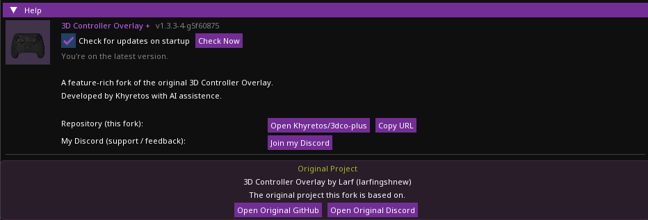
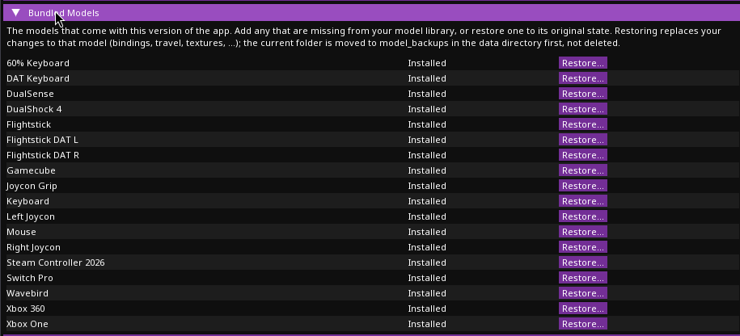
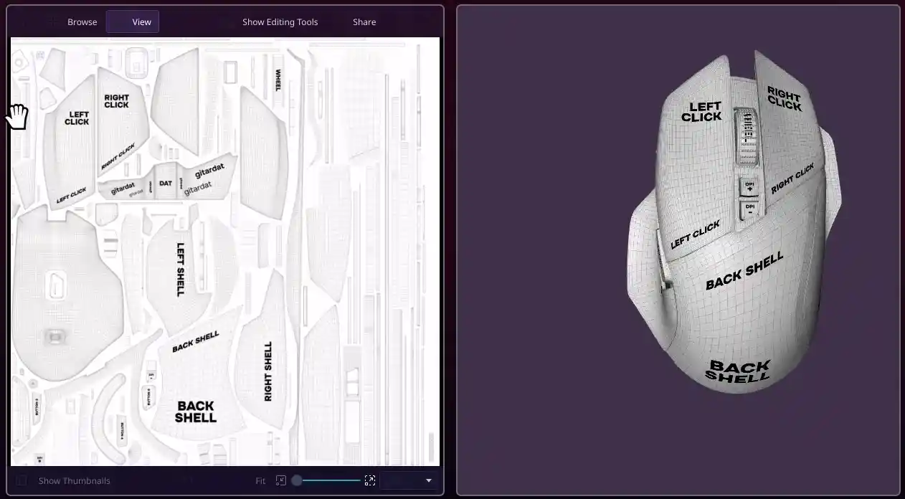
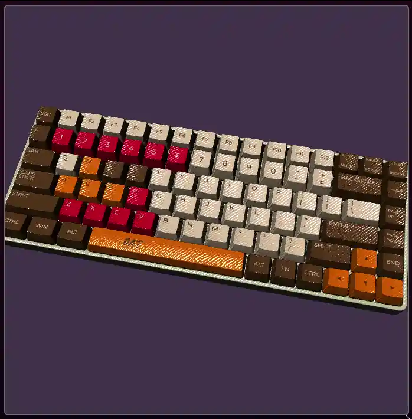
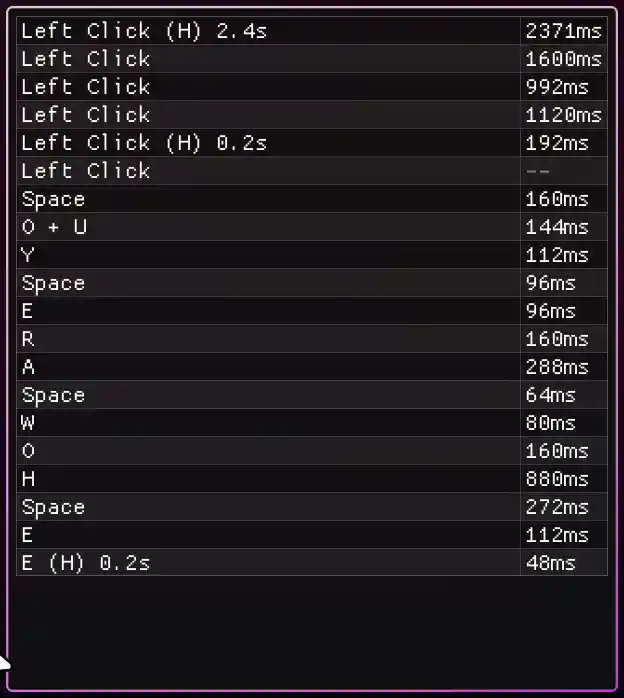
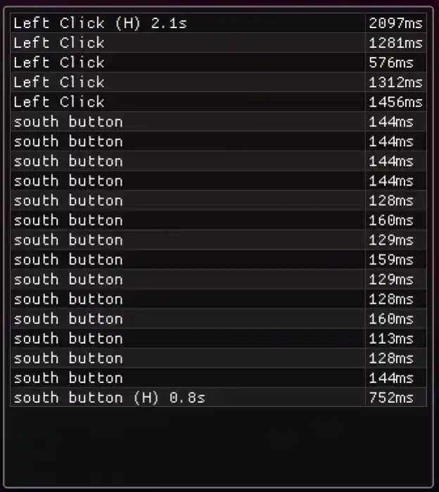
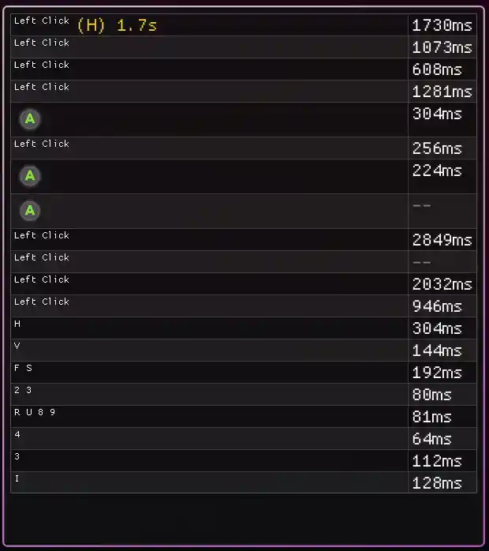
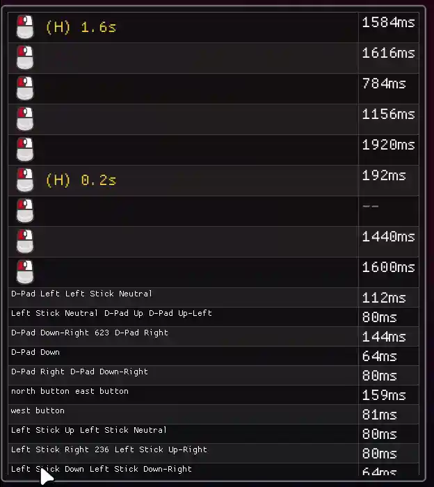
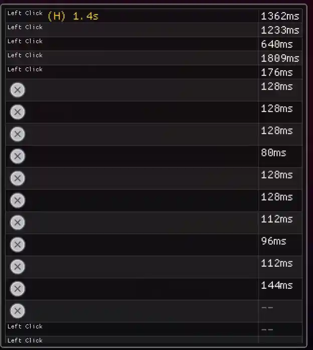

# 3D Controller Overlay +


> ⚠️ **AI-assisted project — read before you judge the code.**
> This fork is built with heavy use of AI coding assistance. That does **not** mean "vibe coded and shipped blind." Every architectural decision — how input flows from SDL into the mesh hierarchy, how the settings/import system is structured, what gets a raw joystick fallback vs. a GameController mapping, how the build/packaging pipeline is put together — was made, reviewed, and debugged by me. AI was the tool; the design, the testing, and the responsibility for what ships are mine. I'm building this openly as a way to test how far I can push my own skills with AI as a collaborator, not to hide behind it. If you find something that looks wrong, please open an issue — I'd genuinely rather know.

**3D Controller Overlay +** (`3dco+`) is an AI‑assisted continuation of [**3D Controller Overlay**](https://github.com/larfingshnew/3d-controller-overlay) by **Larf**. It renders a live 3D model of your input device — buttons, sticks, triggers, touchpads, keys, gyro/accel — so content creators can show their controller, keyboard, or mouse in action without a handcam.

This is a **fork, not a replacement**. It exists as an homage to the original tool and its creator, rebuilt on top of the same rendering foundation but pushed further. All credit for the original concept, models, and engine goes to Larf. If you just want the classic, minimal version, go use [the original repo](https://github.com/larfingshnew/3d-controller-overlay) — it's great on its own.

The **`+`** in the name means exactly that: **improvements and extra features** layered on top of the original — more controllers, more rendering features, more input paths, more build tooling — while keeping the same "point it at your input device and it just works" spirit. It's also a personal passion project: a way for me to see what I'm actually capable of building and maintaining with AI as a collaborator rather than a crutch.

## What's new in 1.4.1

- **Fixed: keyboard and mouse input over the network.** A receiver only showed controller and joystick input: key bindings never matched (a key-name case mismatch) and mouse movement was always sent as zero. Keys, mouse movement, mouse buttons (including 6 to 8) and the scroll wheel now all come through. Only the keys and mouse inputs the model is bound to are sent, never everything you type. Update both the sender and the receiver.
- **Fixed: the Linux AppImage showing no version** in AppImage installers such as AppImageLauncher or Gear Lever. The AppImage's desktop entry now carries the app's version.

## What's new in 1.4.0

- **"What's New" after an update.** The first launch of a new version shows its release notes once, and offers any bundled models that are new in that version (pre-ticked), so new models no longer require deleting your models folder. Never shown on a normal launch or a fresh install.
- **Bundled Models section in Settings.** Every model the app ships, marked Installed or Missing, with **Add** for missing ones and **Restore...** to reset one to its original. Restoring asks first, and moves your current version to `model_backups` in the [data directory](#where-your-data-lives) instead of deleting it.
- **Optional update check.** On startup the app asks GitHub whether a newer release exists and, if so, shows its release notes with a link to the download page and a "don't remind me about this version" option. Nothing is downloaded or installed automatically. Toggle it (or **Check Now**) under Help.
- **The version is visible everywhere:** the Settings window title (taskbar/dock), the tray tooltip, the Windows `.exe`'s Properties → Details, and macOS Get Info (previously always 1.0), as well as Help. See [Updates & version](#updates--version).
- **Lower CPU usage.** The Frame Cap is now respected even on high-refresh monitors: the Settings window's vsync used to drive the whole app at 144/240 fps. Settings redraws at 10 fps while in the background and not at all while minimized, and per-part rendering is much cheaper, roughly halving main-thread CPU per frame on large models like the keyboard.
- **Smoother text and color emoji.** The UI font is now Noto Sans rendered through FreeType instead of ImGui's pixel font, so dashes, quotes, arrows, check marks and color emoji (Twemoji) render instead of showing as `?`.

## What's new in 1.3.3

- **Additional Bindings: more than one input per mesh.** Under Movement & Animation, a mesh can now have any number of extra input bindings on top of its existing one, each with its own Invert, Travel X/Y/Z, Rot X/Y/Z, and Smooth Travel settings. Every active binding's Travel/Travel Rotation is added together each frame - so a joystick hat (one physical mesh, several directions) can tilt its own way per direction, a diagonal press tilts on two axes at once, and opposite bindings cancel out naturally. A mesh highlights if any of its bindings is active. Supports "press"-style inputs (buttons, hats, axis-as-direction, keyboard keys, mouse buttons); sticks, raw axis passthrough, and touchpads stay single-binding. Existing models are unaffected - their current binding simply becomes the primary one - and the new `extra_bindings` field in `info.json` is optional.
- **New bundled models: Flightstick DAT L and Flightstick DAT R** - left- and right-handed flightsticks by [DAT](https://www.youtube.com/@gitardat), with a hat that already uses Additional Bindings for its directions.
- **Fixed: Highlight Color (Global) losing its opacity on restart.** Only the color's RGB was saved to `settings.json`, so alpha silently reset to fully opaque every time. All four channels are saved now; older 3-value settings files still load.
- **Fixed: a mesh's highlight value not being saved** to `info.json` - it always reloaded as 0. Older files without it load unchanged.
- **UI polish:** the Additional Bindings input picker and the Pick meshes... / Copy Travel to Selected row no longer overflow past the width of the rest of the Movement & Animation panel.

## What's new in 1.3.2

- **Fixed: a hard crash on Windows when closing a controller window.** Dear ImGui's OpenGL backend bundles its own, separate GL function loader by default, independent of the GLAD loader the rest of the app uses - it only ever initializes those function pointers once, globally, for the whole process, and resets that same shared state every time a window's ImGui backend shuts down (exactly what happens on close). The next window to render anywhere afterward silently rebound every one of those pointers to its own context instead, leaving every other already-open window calling through pointers that were no longer valid for it - the app is now told to use the same GLAD loader everywhere instead, so there's only ever one, correctly-synced set of pointers. Windows/AMD hardware surfaced this one first, but the underlying issue wasn't platform-specific.
- **Fixed: bundled example models (DAT Keyboard, 60% Keyboard) not showing their textures on a fresh install.** Their saved texture paths pointed at the original author's own machine, meaningless anywhere else - the app already had logic to fall back to a model's own `textures` folder when a saved path doesn't resolve, but the bundled files themselves still carried that now-meaningless absolute path. They're now shipped with a plain, portable path instead, so textures show up correctly the first time, on any machine.

## What's new in 1.3.1

- **Texture files now live inside your model's own folder.** Add a texture and it's copied into the model's own `textures` folder instead of being read from wherever you originally picked it from forever after - so moving or deleting that original file (often somewhere generic like Downloads) no longer breaks the model. Remove a texture and its own copy is cleaned up too, as long as nothing else in the model still references it. And if a model's saved texture path doesn't resolve on this machine - a bundled example, or a model copied over from somewhere else - the app now looks for the same filename in the model's own textures folder before giving up on it. Filenames are sanitized for cross-platform safety along the way (Windows forbids some characters and names that Linux/macOS allow).
- **Flip Y now off by default** for a newly-added texture, replacing the previous default of on. The original default was tuned against a single real model+texture pair early on; broader use since showed that combination wrong more often than right for the images people actually import.
- **"Reset All Meshes to Global Textures"** now sits on the same line as "New Global Texture" next to the Global Texture editor, and there's a matching **"Reset All Meshes to Global Material"** for the same kind of bulk cleanup on the material side - both for applying a changed global texture or material across a model where many meshes already have their own overrides, without switching to each one and clearing it by hand. See [Materials](#materials).
- **Bulk Travel/Travel Rotation tools** in Movement & Animation, reworked - alongside "Copy Travel to All Buttons" there's now a **"Remove Travel from All Buttons"** (the opposite: zeroes it back out), and copying to specific meshes now uses a checkbox picker instead of a name-substring filter, so you can select exactly the meshes you want without depending on a shared naming convention.
- **Highlight Blend Mode**: **Add** is now the default (layers the highlight color on top of the part's own texture, so the underlying detail stays visible and brightens/tints rather than disappearing) instead of **Replace** (fully covers the texture at full strength) - and it can now be set per-mesh under Highlight Override, not just globally for the whole model.
- **Tray icon toggles for Click-Through and Drag to Move (Linux only, for now).** Each open controller window - and its Input History window, if one's open - gets its own submenu in the tray icon's right-click menu with these two toggles, reachable without the OS-level permission that the shortcut-based version needs (see the Linux shortcuts fix below - this is a fallback for setups where that permission was never granted).
- **Fixed: shortcuts silently not working on some Linux setups.** The underlying cause was a permission issue (this app's account not being in the `input` group, needed to read raw input devices) that produced no error or indication anywhere - Settings now shows a clear ✓/✗ status line under Enable Shortcut Monitoring once it's on, and the ✗ case explains exactly how to fix it.
- **Fixed: an Ignore Button rule on a glyph style's Combine With target not taking effect.** Glyph lookup itself already followed a style's Combine With chain (so a style missing a glyph could inherit one from what it combines with) - the ignore-rule check didn't follow that same chain, so a rule set on the combine target silently never applied while viewing the combining style.
- **Fixed: a per-mesh Highlight Override could silently reset itself.** Its color and blend mode were always saved and loaded correctly, but the toggle controlling whether they were actually used was only ever saved, never loaded back - so it quietly reset to off every time the model reloaded from its file.
- **Lower baseline CPU usage**, especially noticeable on models with many meshes or several texture maps per part. Shader compilation, GL uniform lookups, and texture-uniform name bookkeeping used to be rebuilt from scratch on every mesh, every single frame, regardless of whether anything had actually changed; all of it is now cached.

## What's new in 1.3.0

- **PBR-style texture maps.** Alongside the existing Diffuse/Specular/Emissive types, a texture can now be a **Normal Map** (adds surface detail — bumps, grain, panel lines — without extra geometry), **Metallic Map**, **Roughness Map**, or **AO Map** (ambient occlusion). This isn't a full physically-based renderer bolted on — it's a practical approximation layered onto the existing lighting model, chosen deliberately over a much larger lighting-engine rewrite. See [Textures & UV Mapping](#textures--uv-mapping).
- **Global textures and materials.** Set a texture (any type — Diffuse, Normal Map, AO, etc.) or a material (ambient/diffuse/specular/shininess/color) once at the model level instead of on every part individually. A part with its own texture of a given type, or its own custom material, always overrides the global one — global is purely a fallback for parts that don't define their own. See [Materials](#materials).
- **Right-click menu on controller windows.** Right-click anywhere on the model for a quick menu — **Reset View**, **Enable/Disable Click-Through**, **Enable/Disable Drag to Move** — without digging into Settings for these three actions.
- **Fully configurable shortcuts.** Click-Through and Drag-to-Move can each be bound to any keyboard key now, not a fixed short list — pick whatever's comfortable and doesn't collide with anything else you use. A single **Enable Shortcut Monitoring** toggle (off by default) turns this on for every window, on every platform, rather than the feature working differently depending on your OS.
- **Model Description field**, alongside the existing Source URL, for crediting a model's contributors, leaving setup notes, or anything else worth keeping with the model — saves and loads with the model itself and has no effect on how it looks or behaves.
- **Unsaved-changes confirmation before quitting.** Pressing Escape, closing a controller window, and the tray icon's Quit now all check for pending changes first and offer **Quit Anyway**/**Cancel**, instead of silently discarding an accidental close.
- **Fixed: Source URL and Description not resetting when switching models.** Switching to a model whose own file doesn't set one of these fields used to leave the _previous_ model's value displayed, since the same in-memory model object is reused across a switch rather than rebuilt from scratch — now correctly resets to blank.
- **Fixed: crashes when adding or removing textures**, including removing the last texture left in a mesh's list.
- **Fixed: texture GPU memory not being freed** on window close or when switching to a different model — affected both per-part and global textures.
- **Fixed: repeated Wayland log spam** from a window-position query this app has no way to answer on that platform (a deliberate Wayland restriction, not a bug) — now queried once and skipped afterward instead of every frame.

## What's new in 1.2.0

- **Input History window.** A separate always-on-top overlay per controller/keyboard/mouse window showing recent presses, fighting-game style — Raw text, ms/frame-annotated Notation, or a fully data-driven set of icon packs (Xbox/PlayStation/Switch/Steam Deck/Keyboard&Mouse, or your own — see [Input History](#input-history) for the full settings list: gyro flick detection, per-trigger analog depth, independent timing/opacity controls, and more).
- **Custom Glyph Mappings.** Build your own icon set the same way you'd map a custom controller model — an empty table, one row per input, pick or upload an image for each, optionally fall back to another style for anything you don't define yourself. Shows up as a Display Style choice immediately.
- **Fixed: texture assignments weren't being saved.** Adding a texture to a mesh worked in the moment but was silently lost the instant the model reloaded or the app restarted, since it only ever existed in memory. Now persists correctly.
- **UV mapping diagnostics.** Loading a mesh now detects and warns when it has no meaningful UV variation — almost always a missing/degenerate UV unwrap in the source file (common after mesh optimization tools that don't preserve one), the actual cause behind a texture rendering as one flat color. 3dco+ has always used the mesh's own standard UV coordinates (never object-space/triplanar/normal-based mapping) — see [Textures & UV Mapping](#textures--uv-mapping).
- **Better `.blend` import errors.** Direct `.blend` import is unreliable for many files (a long-standing Assimp library limitation) — a failed import now says so directly in Settings and points at exporting as OBJ/FBX/glTF instead, rather than a silent failure or a cryptic log-only error.
- **Fixed: camera pan wasn't saved.** Panning a window's camera (Pan X/Y) reset to center on every reload.
- **Fixed: axis capture couldn't produce a bidirectional binding.** Capturing an input for a Dual Highlight axis always baked in a one-directional response tied to whichever way you happened to move the stick during capture — travel/rotation would only ever swing through half its configured range (e.g. 0–90° instead of -90–90°) no matter which way you actually moved the stick afterward. Capturing now produces the correct bidirectional binding when the mesh has Dual Highlight enabled.
- **Real compound-motion detection.** Quarter-circles, dragon-punch motions, half-circles, and full 360s are now actually recognized as you input them, not just displayable via manual glyph mapping — see [Input History](#input-history)'s Motion Timeout setting for the (configurable, auto-scaling) timing window, with a tooltip comparing it against Street Fighter 6, Tekken 8, and Guilty Gear Strive.
- **Theme.** A new Settings section (before Help) for customizing the app's three accent colors, with a one-click reset to the defaults — applies immediately across Settings and every window it opens (Log, Glyph Mapping Editor, Input History), and is saved like any other setting.
- **Texture Flip X/Y**, alongside the existing Offset/Scale/Rotation controls — for source images that read mirrored on a mesh with no way to fix that by editing the image itself without breaking its UV alignment. Texture Type/X Wrap/Y Wrap are now proper dropdowns instead of drag-sliders with only 2-4 valid values.
- **Unsaved-changes indicator.** The Model section header shows "Changes made without saving" after a texture add/remove/edit, mesh add/remove/duplicate, or model import, until the model's next save (several actions save automatically, not just one explicit button).
- **Fixed: D-Pad showed both its direction digit and a separate button entry** in Input History for the same press (e.g. both "2" and "D-Pad Down", or both a glyph and a number) — D-Pad presses are now represented once, via direction, the same way a stick's direction already was.
- Plus a round of smaller Input History and window-management fixes: the mapping editor is now its own resizable, properly-decorated window instead of embedded in Settings; Input History windows support the same drag-to-move/scroll-to-resize controls as controller windows; the main Settings window's scrollbar works again when content is taller than the window (an `ImGuiWindowFlags_NoDecoration` flag was silently disabling it); and every subwindow now consistently uses the app's theme instead of ImGui's generic default.

## What's new in 1.1.1

- **Smooth Travel Animation.** Buttons, bumpers, and paddles can now ease into a press instead of snapping instantly — per-mesh toggle plus a duration slider, with **Copy to All Buttons**/**Unassign from All Buttons** to apply it across the whole controller in one click. Deliberately not available on sticks, triggers, or touchpads/touchpoints, since those track a live physical position every frame and easing them would just look like input lag.
- **Fixed Popup and Travel silently disabling each other.** A mesh flagged as a bumper/paddle with "Popup Bumpers"/"Popup Paddles" enabled would stop responding to Travel/press animation entirely; the two now stack correctly.
- **Fixed the Touch Area's Yaw/Pitch/Roll sliders** rotating only a small fraction of the angle actually shown (a degrees/radians mismatch) — they now match the displayed value exactly.
- **Settings window polish:** collapsible section headers now get their own darker background tint instead of blending into the plain window background above them.

## What's new in 1.1.0

- **Network functionality** – send a window's live mesh state (button/axis/touch, keyboard and mouse data) over UDP or TCP to another instance of the app on the same machine or over the network, so you can render the overlay on a second PC (e.g. a dedicated streaming/capture box) instead of the one you're playing on.
- **Fixed transparent background compositing on AMD and NVIDIA.** The "Transparent Background" option now actually produces a transparent framebuffer on drivers/compositors where it previously silently failed.
- **Overlay performance fixes.** Resolved input lag and stuttering that showed up specifically when running with click-through enabled while something else (e.g. a game) had foreground focus.
- **Custom shader effects.** Pixel-art and cel-shaded/toon looks rewritten for genuine depth (hue-graded bands, view-angle form shading) instead of a subtle color tweak; Aurora, Infernal, and Rainbow reworked for a much more convincing look; a new **Galaxy** shader; and a fully-replaced **Black Hole** effect (previously a generic ported ShaderToy pattern, now an actual swirling accretion disk). Plus ShaderToy-compatible shader import — including channel textures (`iChannel0`-`iChannel3`): drop in your own image via the new **Add Resource** button, or leave it unset and a channel that a shader expects (e.g. a noise texture) is generated automatically instead of rendering black.
- **New Steam Controller 2026 model** with a significantly smaller file size (same look, far less geometry/texture data).
- **Log window is now a real always-on-top window.** Previously it lived inside the settings window and got sent behind it the moment you clicked elsewhere in Settings; now it's its own window that stays on top regardless, and log lines are copyable (click-drag to select, Ctrl+C, or the new **Copy All** button).
- **Taskbar/tray icon now shows the app's own icon** instead of a generic system placeholder, and is now supported on **all three platforms** — Windows, Linux (StatusNotifierItem/D-Bus), and macOS (NSStatusItem), the last of which had no tray icon at all before.
- **New "Enable Debug Mode" setting**, next to "Enable Taskbar Icon". Verbose diagnostic logging (e.g. a line per mesh loaded) is now off by default, fixing a small but noticeable delay when loading models with many parts — turn it on before opening the log window if you need to report a bug.

### Upgrading from 1.0.0

- **Back up your custom models and `settings.json`** (see [Where your data lives](#where-your-data-lives)) before upgrading, as a general precaution with any major version bump - not because this release is known to eat your data, but because "known limitation" and "undiscovered bug" look identical from the outside, and a backup costs nothing.
- Existing `settings.json`/`info.json` files from 1.0.0 are expected to keep working - missing fields fall back to sensible defaults rather than failing to load. If you do hit a crash tied specifically to old settings, please open an issue with your `settings.json` attached; that's what let us track down and fix an actual crash of this kind during 1.1.0's development (a bug in the new Linux tray icon code, triggered by tray icon being enabled in an existing settings file - already fixed above).

## What's new in 1.0.0

- **Custom model import** via Assimp (FBX, glTF, OBJ, etc.)
- **Pivot‑point editing** by dragging in the 3D viewport
- **Per‑part material alpha** (transparency)
- **Dual‑highlight colors** for axes (positive/negative)
- **Touch‑area visualization** for touchpads
- **Multi‑touchpad support** (up to 4 pads × 2 fingers)
- **Keyboard & mouse overlays** (system‑wide, works without window focus)
- **Raw joystick fallback** for unrecognised controllers
- **Gyro & accelerometer** sensitivity/correction, reset combo
- **Structured logging** (spdlog) with in‑app log window
- **CMake** build system + Docker cross‑build scripts
- **AppImage, Windows .exe, macOS universal app** builds
- **Embedded model library** – no separate assets folder

---

## Table of Contents

- [What stayed the same](#what-stayed-the-same)
- [What's new in the `+`](#whats-new-in-the-)
- [What's new in 1.4.1](#whats-new-in-141)
- [What's new in 1.4.0](#whats-new-in-140)
- [What's new in 1.3.3](#whats-new-in-133)
- [What's new in 1.3.2](#whats-new-in-132)
- [What's new in 1.3.1](#whats-new-in-131)
- [What's new in 1.3.0](#whats-new-in-130)
- [What's new in 1.2.0](#whats-new-in-120)
- [What's new in 1.1.1](#whats-new-in-111)
- [What's new in 1.1.0](#whats-new-in-110)
- [What's new in 1.0.0](#whats-new-in-100)
- [How it works](#how-it-works)
- [Supported platforms](#supported-platforms)
- [Platform showcase](#platform-showcase)
- [Where your data lives](#where-your-data-lives)
- [Updates & version](#updates--version)
- [Supported input](#supported-input)
- [Network functionality](#network-functionality)
- [Shader effects](#shader-effects)
- [Textures & UV Mapping](#textures--uv-mapping)
- [Materials](#materials)
- [Input History](#input-history)
- [Theme](#theme)
- [Manual mapping](#manual-mapping-for-unrecognized-devices)
- [Controller showcase](#controller-showcase)
- [Work in progress / known bugs](#work-in-progress--known-bugs)
- [Known issues (tracked)](#known-issues-tracked)
- [Building](#building)
- [Releasing](#releasing)
- [Contributing](#contributing)
- [Credits](#credits)

---

## What stayed the same

- **Core concept**: an OpenGL scene per connected input device, with each button/stick/trigger/key mapped to its own mesh piece that moves, presses, or lights up in real time.
- **Rendering stack**: GLFW + glad (OpenGL loader) + SDL3 + GLM (math) + Dear ImGui (the settings UI).
- **Model format**: parts are still individual `.obj` meshes, assembled per-device from a swappable model library.
- **Directional/point/spot lighting system** and the customizable grid floor.
- **Cross-platform target**: Windows, Linux, and macOS.

## What's new in the `+`

The goal of the `+` fork isn't "more lines of code" — it's closing gaps the original left open and adding the features a streamer/content-creator setup actually needs. Here's what that looks like in practice:

### Rendering & customization

- **Custom model import via Assimp.** You're no longer limited to the built-in controller library — import your own mesh (glTF, FBX, and anything else Assimp reads) and map its parts to buttons/axes through an import-preview/assignment workflow.
- **Pivot-point editing.** Reposition individual mesh pieces by dragging their pivot directly in the 3D viewport, instead of only editing raw offsets in a settings panel.
- **Per-part material alpha (transparency).**
- **Mouse orbit & zoom** for the camera, plus a dedicated **freelook** mode independent from the input-driven camera, with adjustable move/turn/mouse sensitivity.
- **Global and per-button "press" highlight colors**, with original-color tracking so highlighted parts revert correctly.
- **Touch-area visualization**: a drawable wireframe/fill overlay showing the real hit-area of touchpads, useful when lining up custom pads.
- **Multi-touchpad support**: up to 4 touchpads × 2 fingers each, versus the original's single pad.
- **Custom shader effects**, including built-in pixel-art and cel-shaded/toon looks and ShaderToy-compatible import with automatic channel-texture handling — see [Shader effects](#shader-effects).
- **Per-mesh visibility persists with the model** instead of resetting to visible on every reload.

### Networking

- **Send or receive a window's live state over the network** (UDP or TCP), so the 3D overlay can render on a different machine than the one generating the input — see [Network functionality](#network-functionality).

### Input

- **Keyboard overlay.** A system-wide keyboard monitor (native backend per platform — see [Supported platforms](#supported-platforms)) drives a live on-screen keyboard, so keypresses show up even when another window has focus.
- **Mouse overlay.** The same system-wide backend tracks cursor position, buttons, and scroll wheel for a live mouse overlay.
- **Raw joystick fallback.** In addition to SDL3's `GameController` API (used for recognized/mapped pads), the `+` fork can open a device as a raw `SDL_Joystick`, so unmapped or unusual controllers still produce usable input instead of being ignored.
- **Per-axis/button mapping inversion**, so a stick or trigger that reads backwards on your hardware can be flipped without a new SDL mapping.
- **Gyro & accelerometer improvements**: dedicated sensitivity/correction settings, a configurable reset-gyro button combo, and optional debug logging of raw sensor data.

### Engineering / tooling

- **Structured logging via spdlog**, including rotating log files — the original had no structured logging at all. The in-app log window is now its own always-on-top OS window with copyable log lines, and a new **Enable Debug Mode** setting keeps the more verbose diagnostic logging (e.g. per-mesh load lines) off by default so it doesn't cost load-time performance unless you actually need it.
- **Taskbar/tray icon** using the app's own icon, on Windows, Linux, and macOS.
- **CMake-based build system** replacing the original's platform-specific shell/batch scripts, plus convenience scripts (`build-all.sh`, `build-appimage.sh`, `build-macos.sh`, `build-windows.sh`) and Docker-based cross-build files for reproducible packaging.
- **AppImage & `.desktop` integration** on Linux for proper application-menu installation.
- **Embedded model library**: the bundled `.obj` model set is packed into the binary at build time and extracted on first run, so there's no separate assets folder to lose track of.
- **Updated to the latest Dear ImGui version** for improved UI/UX and bug fixes.
- **Updated to SDL3** for better performance, new features, and improved controller support.

New dependencies to support the above: **Assimp** (model import), **spdlog/fmt** (logging), **nlohmann_json** (settings/model metadata), and **FreeType** (font rendering), alongside the original GLFW/SDL3/GLM/stb stack. Linux builds additionally link against **libdbus-1** for the StatusNotifierItem tray icon.

## How it works

At a high level, the pipeline builds on the original:

1. **SDL3** enumerates connected controllers/joysticks and streams button, axis, hat, touchpad, and sensor (gyro/accel) events. A platform-native background thread separately watches the system keyboard and mouse (see [Supported platforms](#supported-platforms)), so those work even without window focus.
2. Each connected device gets its own **GLFW window** and OpenGL context, rendering a 3D scene built from that device's `.obj` parts.
3. Every frame, input state is mapped onto the corresponding mesh: buttons translate along their press axis and/or change color, sticks and triggers rotate/translate proportionally to their live analog value, touchpad finger positions move small touch-point meshes across the pad mesh, and keyboard/mouse events drive the keyboard/mouse overlay meshes the same way.
4. **Dear ImGui** drives the settings window — lighting, camera, colors, mappings, model import/mapping, and window behavior (always-on-top, borderless, click-through/drag-to-move, background color/alpha for green-screen or transparent capture).
5. The pipeline also accepts **raw joystick input** (for devices SDL3 doesn't have a built-in mapping for) and **imported custom meshes** (via Assimp) instead of only the bundled `.obj` library, with an added pivot/highlight/touch-area layer for fine-tuning how everything looks on stream.

## Supported platforms

All three major desktop platforms are targeted and built for:

| Platform   | Status                         | Notes                                                                                                                                                                                                                          |
| ---------- | ------------------------------ | ------------------------------------------------------------------------------------------------------------------------------------------------------------------------------------------------------------------------------ |
| 🐧 Linux   | ✅ Actively developed & tested | Primary development platform. Keyboard/mouse overlay uses raw `evdev` device polling.                                                                                                                                          |
| 🪟 Windows | ✅ Supported                   | Keyboard/mouse overlay uses a low-level `WH_KEYBOARD_LL` / `WH_MOUSE_LL` hook. Built via CMake + MSYS2/MinGW, or cross-compiled from Linux with the included Docker scripts.                                                   |
| 🍎 macOS   | ✅ Supported                   | Keyboard/mouse overlay uses a listen-only `CGEventTap` (requires granting Accessibility/Input Monitoring permission on first run). Built natively via Homebrew, or cross-compiled from Linux with the included Docker scripts. |

Since day-to-day development happens on Linux, the Windows and macOS builds get comparatively less mileage. If you hit a platform-specific issue on Windows or macOS, please file an issue with your OS version and build method — those reports genuinely help.

## Platform showcase

The same live overlay, running natively on all three targets.

| Platform       | Preview                         |
| -------------- | ------------------------------- |
| 🐧 **Linux**   |      |
| 🪟 **Windows** |  |
| 🍎 **macOS**   |      |

## Where your data lives

`3dco+` keeps all of its writable data — settings, imported models, the extracted model library, logs, and the controller mapping database — in a single per-user config directory, not next to the executable:

| Platform   | Location                               |
| ---------- | -------------------------------------- |
| 🐧 Linux   | `~/.local/share/3dco+/`                |
| 🪟 Windows | `%APPDATA%\3dco+\`                     |
| 🍎 macOS   | `~/Library/Application Support/3dco+/` |

You can jump straight there from inside the app via **Settings → Open Data Directory**. There's also an **Open Log Window** button right next to it if you'd rather watch the log live instead of digging through files — handy on macOS/Linux, where no console is attached to the process unless you launched it from a terminal.

## Updates & version

**Which version am I running?** It's in the Settings window's title (so also the taskbar/dock entry), the tray icon's tooltip, and the **Help** section. Without opening the app: on Windows, right-click `3dco+.exe` → **Properties** → **Details**; on macOS, **Get Info** on the app.

**After updating**, the first launch shows a **What's New** window with that version's release notes, once. If the update ships models you don't have yet, they're listed there with a checkbox each; untick any you don't want, then **Add Selected Models**.

**Update check.** With **Check for updates on startup** on (under Help, on by default), the app asks GitHub once per launch whether a newer release exists. If one does, a popup shows its release notes, with **Open Download Page** and a **Don't remind me about this version** checkbox; the next release is still announced. Nothing is downloaded or installed for you, and if GitHub can't be reached nothing is shown. **Check Now** runs the same check on demand.



**Bundled Models** (a Settings section, next to Theme) lists every model that comes with the app:

- **Add** puts a missing one back in your library (**Add All Missing** for all of them).
- **Restore...** resets one to how it shipped, after a confirmation. Your current version of it isn't deleted: it's moved to `model_backups/<model> <date>` in your [data directory](#where-your-data-lives).



## Supported input

| Input type                                                                         | Status                                                                                                                |
| ---------------------------------------------------------------------------------- | --------------------------------------------------------------------------------------------------------------------- |
| Standard gamepads (Xbox, DualShock/DualSense, Switch Pro, Joy-Con, GameCube, etc.) | ✅ Supported (via SDL3 GameController)                                                                                |
| Unmapped/generic joysticks                                                         | ✅ Supported (via raw SDL3 Joystick fallback)                                                                         |
| Steam Controller                                                                   | ✅ Supported (detected natively with SDL3),Limited on macOS (see note below)                                          |
| Keyboard overlay                                                                   | ✅ Supported (system-wide, works without window focus)                                                                |
| Mouse overlay                                                                      | ✅ Supported (position, buttons, scroll — system-wide)                                                                |
| Gyro / accelerometer                                                               | ✅ Supported, with sensitivity/correction tuning                                                                      |
| Touchpads (DualShock/DualSense)                                                    | ✅ Supported, multi-touch, multiple pads                                                                              |
| Flightstick / throttles                                                            | ✅ Supported (bundled Flightstick, Flightstick DAT L/R models); manual mapping may be needed for your own hardware    |
| Racing wheel                                                                       | 🚧 Work in progress (I currently do not posses a racing whe eel or pedal but i assume that it can be mapped manually) |

Gamepad button/axis layouts are resolved through SDL3's community-maintained [`gamecontrollerdb.txt`](https://github.com/mdqinc/SDL_GameControllerDB) database (embedded in the app, covering most Xbox/PlayStation/Switch Pro/Steam Controller/third-party pads). If your controller shows up as a raw, unlabeled joystick instead of a named gamepad, it isn't in that database yet — you can either add an entry to `gamecontrollerdb.txt` in your [data directory](#where-your-data-lives) (e.g. using [SDL3 Gamepad Tool](https://generalarcade.com/gamepadtool/)) and restart, or just map it manually using raw joystick bindings in the Mapping panel, which works regardless of whether SDL3 recognizes the controller. If you do get a new controller working, consider [contributing the mapping upstream](https://github.com/mdqinc/SDL_GameControllerDB) so other SDL3-based apps benefit too.

**Note on Steam Controller support:** With the upgrade to SDL3, the Steam Controller is now detected and works directly on all supported platforms (Windows and Linux) without requiring any special workarounds. This is a significant improvement over the SDL2 version, where manual intervention was often needed. I am still looking into how to make it work in macOS.

## Network functionality


Note the example im showing is a steamdeck running the software and sending it to the other pcs which are a Windows, Mac and Linux machine. The app is downloaded directly from the repository and i added it as a "Non Steam Game". Start the network as a "Sender" and just start a game. Just note that you need to open a port in your pc to make it connect. It is not meant to be used with encryption or security this feature was made for a simple and direct purpose (to connect to another device in your netowrk).

Each controller window can send its live mesh state (button presses, axis values, touch positions, keyboard keys, mouse movement, buttons and scroll) over the network to another running instance of the app, instead of only rendering it locally. This is aimed at setups where the machine generating input isn't the one you want doing the capture/overlay compositing — for example, rendering the overlay on a dedicated streaming PC while the game runs on a separate gaming PC. Or running the software on a steamdeck and sending the input to another PC, your world your rules!

Open a controller window's **Window** section to find the network controls:

| Setting            | What it does                                                                                                                                  |
| ------------------ | --------------------------------------------------------------------------------------------------------------------------------------------- |
| **Mode**           | `Sender` reads local input and transmits it. `Receiver` listens on a port and drives the mesh from received data instead of local input.      |
| **Protocol**       | `UDP` — fast, connectionless, supports broadcast (e.g. `255.255.255.255`). `TCP` — reliable, one-to-one (a receiver accepts a single sender). |
| **IP Address**     | Destination address in Sender mode (the receiving machine's IP, or a broadcast address for UDP).                                              |
| **Port**           | Port to send to (Sender) or listen on (Receiver). Must match on both ends.                                                                    |
| **Send Rate**      | How often a Sender pushes an update: `Max`, `60 Hz`, `30 Hz`, `15 Hz`, or `10 Hz`.                                                            |
| **Enable Network** | Turns the above on/off for this window. Connection status (connected/listening/disconnected) is shown live once enabled.                      |

A quick two-PC setup looks like:

1. On the **gaming PC**: open the controller window you want to share, set **Mode** to `Sender`, enter the streaming PC's IP address and a port, pick a protocol, then check **Enable Network**.
2. On the **streaming/capture PC**: open the same model, set **Mode** to `Receiver`, use the same port and protocol, then check **Enable Network**.

Local controller input is ignored on a window that's in Receiver mode — everything it displays comes from the network instead.

## Shader effects

Each mesh (or a whole window, via the global shader setting) can use a custom fragment shader instead of the default lit material — accessible from a mesh's **Shader Effect** section in Settings. A handful of looks ship built in, including:

- **Pixel Art** – genuinely blocky, posterized shading (screen-space "pixels", not just a color tweak), with hue-graded shadow/highlight bands and view-angle form shading so dark/gray controllers still read with depth instead of turning into a flat gray-and-black blur.
- **Cel-shaded / Toon** – flat anime-style color bands, a hard-edged specular highlight, outlines detected from three combined signals (surface creases, silhouette grazing angle, and depth discontinuities) so the outline actually shows up reliably instead of only on sharp corners, and a view-angle form-shading term so curved parts (thumbstick domes, concave buttons) keep their shape from any viewing angle, not just ones where the key light happens to help.
- **Aurora** – drifting, domain-warped curtains in a green→cyan→violet gradient, rather than a static interference pattern.
- **Galaxy** – a swirling spiral nebula with a bright core and a twinkling starfield, in the "Fortnite skin" style.
- **Infernal** – dark, rough rock split by glowing, pulsing red-orange cracks, going for a "cartoon hell" look rather than bright cartoon dirt.
- **Rainbow** – a domain-warped, marbled hue field with random sparkle, instead of a clean predictable color sweep.
- **Black Hole** – a swirling accretion disk being pulled into a genuinely dark event horizon with a bright photon ring at its edge, closer to how cartoons/anime draw a black hole than a literal simulation.

A note on results: these shaders were tuned against a handful of controllers, not every model — how well one looks depends a lot on the shape and base color of the specific controller you're applying it to. Some combinations will look great immediately; others may look flat, too dark, or too busy. If a shader doesn't look right on your controller, try adjusting the mesh's base color or brightness settings first — most looks improve a lot with a little manual fine-tuning rather than being a fixed, one-size-fits-all effect.

|                                                                |                                                              |
| -------------------------------------------------------------- | ------------------------------------------------------------ |
| **Pixel Art**<br>     | **Cel-shaded / Toon**<br> |
| **Aurora**<br>             | **Galaxy**<br>           |
| **Infernal**<br>       | **Rainbow**<br>        |
| **Black Hole**<br> |                                                              |

**Importing your own ShaderToy shader:** paste (or point the app at) a standard ShaderToy `mainImage()` shader and it's automatically wrapped with the right uniforms (`iTime`, `iResolution`, `iMouse`, `iFrame`, etc.). If the shader samples a channel texture (`iChannel0`-`iChannel3`) — very common for shaders that use a noise or gradient texture — you no longer need to track that texture down and wire it up by hand:

- Click **Add Resource...** next to the shader dropdown to pick an image file; it's copied into that shader's own folder and bound to the next free channel automatically.
- Any channel a shader references that you _haven't_ supplied an image for gets a generated tileable noise texture instead of rendering black — so most ShaderToy shaders that expect "some noise" just work the moment you paste them in, and you only need **Add Resource** for shaders that need a _specific_ image (a gradient ramp, a logo, etc.).

Shader files live under `shaders/<name>/` in your [data directory](#where-your-data-lives) — `fragment.glsl` plus any `channel0`–`channel3` image files — so you can also edit or drop resources in by hand if you'd rather not use the file picker.

## Textures & UV Mapping



3dco+ always uses a mesh's own UV coordinates — standard OBJ `vt` data, or the equivalent channel from whatever format you imported — never object-space, triplanar, or normal-based mapping. Add a texture via a mesh's **Materials/Textures** section and it follows the mesh's existing UV unwrap exactly. Each texture has a **Type**:

- **Diffuse** — the base color image.
- **Specular** — controls highlight intensity/color.
- **Emissive** — glows regardless of lighting.
- **Normal Map** — adds surface detail (bumps, grain, panel lines) without extra geometry. Use an image where flat/undetailed areas are a blue-purple color (roughly RGB 128, 128, 255) — the standard format most 3D tools export normal maps in.
- **Metallic Map** — a grayscale image; brighter areas read as more metallic.
- **Roughness Map** — a grayscale image; brighter areas scatter reflections more (rougher/softer), darker areas stay sharp (smoother/glossier).
- **AO Map** — a grayscale image; darker areas are treated as more occluded (crevices, contact points), brighter areas as more exposed to ambient light.

Alongside Type, every texture has Offset/Scale/Rotation controls plus Flip X/Flip Y for source images that read mirrored on the mesh. A newly-added texture starts with Flip Y off, which lines up correctly for most images exported the ordinary way; an existing texture loaded from a saved model always keeps whatever it was actually saved with, so this doesn't change anything already correctly configured.

If a texture looks wrong (one flat color, smeared, misaligned), that's almost always the mesh's own UV data, not a setting here — most commonly a missing or degenerate UV unwrap from an export/optimization workflow that didn't preserve one.

Any of the above types can also be set once at the model level instead of per part — see [Materials](#materials) for global textures and how the per-part override works.

## Materials



Credits to [DAT](https://www.youtube.com/@gitardat) for the amazing 3D keyboard model and files to make this example possible!.

Set a texture or a material property once at the model level instead of assigning it to every part by hand:

- **Global Textures** — its own section above the per-part texture list. Add a texture there the same way you would for a single part and give it a Type (any of the types listed in [Textures & UV Mapping](#textures--uv-mapping) above). Each part has a **Use Custom Textures** toggle: off (default) means the part uses the Global Textures list above, entirely; on means it uses its own texture list instead, entirely. It's an all-or-nothing switch per part, not a per-type merge — turning it on for a part with only its own Diffuse set doesn't pick up a global Normal Map alongside it, for example.
- **Global Material** — the same idea for material properties (ambient, diffuse, specular, shininess, color). Set it once at the model level; any part that needs different values can enable **Use Custom Material** on that part and set its own instead.

The override is per part — some parts can use their own textures/material while others use the model's global ones — but for any one part, it's all-or-nothing rather than mixed field by field.

## Input History

|                                                                                                           |                                                                         |
| --------------------------------------------------------------------------------------------------------- | ----------------------------------------------------------------------- |
| **Raw**<br>                                                               | **Raw fighting game notation**<br> |
| **Fighting-Game Notation glyphs**<br> | **Keyboard Glyphs**<br>     |
| **PS5 Glyphs**<br>                                                 |                                                                         |

A separate always-on-top window per controller/keyboard/mouse window, showing a scrolling list of recent presses — the input-display style fighting games like Street Fighter and Tekken use, equally handy for tutorials. It's an independent overlay window (own transparency/click-through/opacity, same as a controller window), toggled per-window from that window's **Input History** section in Settings.

**Display style** — one dropdown, three families:

- **Raw** – plain text labels (`A`, `LB`, `W`, `Left Click`).
- **Fighting-Game Notation** – numpad direction digits (5 = neutral, 1-9 8-way) plus button labels.
- **Icon packs** – the bundled styles (Xbox 360/One/Series, PlayStation 3/4/5, Switch, Steam Deck, Keyboard & Mouse in Dark or Light, FGC Motion combined with either PS5 or Xbox as a starting point), or any mapping you've built yourself (see **Custom Glyph Mappings** below) — all discovered the same way, live, from the `glyphs/` folder. A button a style has no art for falls back to its text label rather than a blank space.

**Other settings, all per window:**

| Setting                                         | What it does                                                                                                                                                                                                                                                                                                                                                                                                                                   |
| ----------------------------------------------- | ---------------------------------------------------------------------------------------------------------------------------------------------------------------------------------------------------------------------------------------------------------------------------------------------------------------------------------------------------------------------------------------------------------------------------------------------- |
| **History Length**                              | How many entries the live window keeps/shows. Doesn't limit the persistent log file below — that keeps everything regardless.                                                                                                                                                                                                                                                                                                                  |
| **Capture** (Gamepad/Joystick, Keyboard, Mouse) | Which device types this window records — independent of what's actually bound to the model's meshes, since the point is showing everything you pressed, not just what has a visible part.                                                                                                                                                                                                                                                      |
| **Capture Gyro (Flicks)**                       | Logs a fast, deliberate rotation ("Left Flick", "Up Flick", etc.) instead of every small motion, which would flood the history and bury real presses. **Motion Sensitivity** filters out slow drift/tremor entirely; **Flick Threshold** + **Flick Window** control how much rotation within how long counts as one flick; **Flick Cooldown** stops one continued motion from spamming repeated entries. Requires Gyro enabled for the window. |
| **Merge Simultaneous Presses**                  | Groups inputs landing within **Simultaneous Window (ms)** of each other into one entry (`A+B`) instead of a line each — a real, tunable time gap (default 50ms) rather than requiring the exact same frame. Matters for fighting games (throws, macros, plinks); leave off for a clean one-input-per-line list in most other games.                                                                                                            |
| **Show Return to Neutral**                      | Off by default: letting go of the stick/D-pad doesn't get its own entry, only the direction that actually mattered does. Turn on to log every return to center too.                                                                                                                                                                                                                                                                            |
| **Direction Source**                            | Which input drives the notation direction digit: Auto (whichever of D-Pad/Left Stick is actually deflected), or an explicit D-Pad/Left Stick/Right Stick override for lefty or unusual control setups.                                                                                                                                                                                                                                         |
| **Motion Timeout**                              | How much time a compound motion (quarter-circle, dragon punch, 360, etc.) has to complete, calibrated to a 2-step quarter-circle (236/214) — longer motions automatically get proportionally more time, the same way real games scale theirs. Default (220ms) sits close to Street Fighter 6's own quarter-circle window; the setting's tooltip compares it against Tekken 8 and Guilty Gear Strive too.                                       |
| **Trigger Press Threshold**                     | How far a trigger needs to be pulled to register at all — triggers are analog and show their depth as a percentage next to the icon (e.g. `RT 67%`), not just an on/off press.                                                                                                                                                                                                                                                                 |
| **Show Input Timing**                           | Independent of display style (works with Raw/Notation/any glyph pack) — adds a Timing column showing ms or frames since the previous input. **Reset After** sets the gap that stops counting as measured timing (shown as `--`) rather than just meaning you paused.                                                                                                                                                                           |
| **Show Date/Time**                              | Adds a Time column (leftmost) with the real wall-clock time each entry was captured, for whenever you want to know exactly when, not just how long since the last one.                                                                                                                                                                                                                                                                         |
| **Background Opacity / Content Opacity**        | Independent transparency for the window background vs. the text/glyphs themselves — a 70% black background with fully opaque icons, or the reverse.                                                                                                                                                                                                                                                                                            |
| **Glyph Size / Font Size**                      | Icon size for glyph display styles, and text size for every column (Time/Input/Timing) — independent of each other.                                                                                                                                                                                                                                                                                                                            |
| **Alternating Row Colors**                      | On by default. Turn off for a fully transparent background (0% Background Opacity) to show only the glyphs/text with nothing else rendered - the row shading is a separate layer from the background itself, so it's otherwise still visible even at 0% opacity.                                                                                                                                                                               |
| **Newest Entry On Top**                         | Off (default): newest at the bottom, scrolling up like a terminal. On: newest at the top, always the first thing visible without scrolling.                                                                                                                                                                                                                                                                                                    |
| **Click-Through**                               | Same idea as a controller window's own click-through.                                                                                                                                                                                                                                                                                                                                                                                          |
| **Drag to Move / Scroll to Resize**             | Same controls as a controller window's own — only meaningful while Click-Through is off, since with it on this window never receives mouse events at all.                                                                                                                                                                                                                                                                                      |
| **Log to File**                                 | Writes every captured input to its own timestamped file under `input_history_logs/` in your [data directory](#where-your-data-lives), independent of History Length — useful for reviewing exactly what you pressed after the fact (e.g. checking a speedrun attempt frame by frame), not just what's currently visible live.                                                                                                                  |

**Custom Glyph Mappings** — its own window (**New Glyph Mapping...** or **Edit Existing Mapping**), working the same way you'd map a custom controller model: an empty table where each row picks an input (Gamepad Button, D-Pad Direction, Gamepad Motion, Trigger, Keyboard, or Mouse) and an image (existing glyph or your own picture, auto-converted/resized) in the last two columns. **Gamepad Motion** is a fixed dropdown of the compound sequences the bundled FGC Motion art covers (`236`, `623`, `360`, etc.) - these motions are actually detected during play (see Input History's Motion Timeout setting), so this is about which glyph represents each one, not whether it's recognized. Optionally set **Combine With** another style as a fallback for anything you don't define yourself (with an option to exclude specific input types from that fallback, e.g. FGC Motion excludes D-Pad glyphs since it already represents direction its own way). **Save** and it shows up as a Display Style choice immediately, for any window — any standard style that goes missing gets silently restored from the bundled pack on next launch. The bundled icon packs are the CC0-licensed Xelu prompt pack — see [Credits](#credits).

## Theme

A Settings section of its own (just before Help) for the three accent colors used everywhere in the app — buttons, section headers, sliders, active tabs, and input field backgrounds — across Settings and every window it opens (Log, Glyph Mapping Editor, Input History):

- **Primary** — the main accent color.
- **Primary (Light)** — hover/highlighted states.
- **Primary (Dark)** — pressed/active states and input field backgrounds.
- **Reset to Default** — one click back to the shipped purple scheme.

Changes apply immediately everywhere, not just in Settings, and save the same way as every other setting — app-wide rather than per-window, since there's only one theme.

## Manual mapping for unrecognized devices

If your controller or input device isn't automatically detected, you can manually map its buttons and axes using the **Mapping** panel in the settings window. Here's how:

1. **Enable Joystick Debugging** – Check the `Log Controller/Joystick` checkbox in the settings UI. This will print raw input values to the log (visible in the Log Window or the log file).
2. **Identify Your Device** – Open the `Controllers` dropdown in the `Controller` section and select your device. It will appear as either a named gamepad (if SDL3 recognizes it) or as a generic joystick.
3. **Map Buttons** – For each mesh (button, trigger, stick, etc.) in the **Mesh List**, set the `Input` column to the correct binding. You can either:
   - Use the dropdown to select a pre-defined input (e.g., `b0` for button 0, `a1+` for axis 1 positive direction), or
   - Click the dropdown and then press the button or move the axis you want to bind — the app will auto-capture it (when the dropdown is open, the app listens for input from that device).
4. **Test Your Mapping** – Once mapped, the mesh should respond to your input in the 3D view. Use the `Log Controller/Joystick` checkbox to verify that the values being read match what you expect.

For more complex devices (like flightsticks or racing wheels), you may need to experiment with axis directions, deadzones, and inversion settings. The `Log Controller/Joystick` checkbox is your best friend for diagnosing what your device is actually sending.

## A couple of things you'll notice

- **The download is a bit bigger than you might expect.** The full built-in model library ships embedded in the binary (see "Embedded model library" above) so the app works out of the box with zero setup and no separate assets folder to lose track of — that's most of what you're seeing in the file size, not bloat.
- **The first launch takes a few seconds longer.** Because that model library is compressed inside the binary, first run needs to unzip it into your [data directory](#where-your-data-lives) before it can use it. One-time cost — every launch after that is fast.

## Controller showcase

Live demo clips for every controller in the built-in model library. (The `+` badge on `3dco+` itself is a nod to this: everything below is an addition on top of what the original project shipped with.)
| Controller 1 | Controller 2 |
| -------------------------------------------------------------------------------------- | -------------------------------------------------------------- |
| **Steam Controller 2026**<br> | **DualSense**<br> |
| **DualShock 4**<br> | **GameCube**<br> |
| **Joy-Con Grip**<br> | **Keyboard**<br> |
| **Left Joy-Con**<br> | **Right Joy-Con**<br> |
| **Xbox One**<br> | **Xbox 360**<br> |
| **Mouse**<br> | **Switch Pro**<br> |
| **Wavebird**<br> | **Flightstick**<br> |

## Work in progress / known bugs

- **Racing wheel** – planned, not yet in model library or input path.
- **macOS/Windows testing** – less real‑world mileage than Linux; expect occasional platform‑specific rough edges.
- **General stability** – edge cases from expanded input and import paths are being ironed out.

---

## Known issues (tracked)

| Issue                                                                      | Status                       | Notes                                                                                                                                                                                                                                                                               |
| -------------------------------------------------------------------------- | ---------------------------- | ----------------------------------------------------------------------------------------------------------------------------------------------------------------------------------------------------------------------------------------------------------------------------------- |
| macOS Accessibility permission required for keyboard/mouse                 | By design                    | See README for instructions.                                                                                                                                                                                                                                                        |
| Gyro reset combo not working on certain controllers                        | Under investigation          | Use manual reset button as workaround.                                                                                                                                                                                                                                              |
| Imported model preview sometimes crashes on large files                    | Rare                         | Reduce polygon count or use simpler format.                                                                                                                                                                                                                                         |
| Taskbar/tray icon left/right-click can act the same on some Linux desktops | Known limitation (host-side) | Some StatusNotifierItem hosts (a few GNOME extensions included) always show the menu on any click once one is advertised, rather than distinguishing left/right. Not something this app controls; macOS/Windows both distinguish correctly since we own the whole click path there. |
| Minimized windows aren't capturable by OBS/other capture tools             | By design (OS-level)         | Minimized windows generally aren't composited by any OS, so no capture method can see their content. Not specific to this app.                                                                                                                                                      |

---

## Building

This fork builds with **CMake** and **pkg-config** on all three platforms. From the repo root:

### 🐧 Linux

```bash
# Debian/Ubuntu
sudo apt install build-essential cmake pkg-config libglfw3-dev libsdl3-dev \
  libassimp-dev libspdlog-dev libfmt-dev nlohmann-json3-dev libfreetype-dev

# Arch/CachyOS
sudo pacman -S --needed base-devel cmake pkgconf glfw sdl3 assimp spdlog fmt nlohmann-json freetype2

rm -rf build && mkdir build && cd build
cmake ..
make -j$(nproc)
```

### 🍎 macOS

```bash
brew install cmake pkg-config glfw sdl3 assimp spdlog fmt nlohmann-json freetype

rm -rf build && mkdir build && cd build
cmake ..
make -j$(sysctl -n hw.ncpu)
```

**Enabling the keyboard/mouse overlay:** on first launch, macOS won't grant the global keyboard/mouse hook access automatically. To turn it on:

1. Open **System Settings → Privacy & Security → Accessibility**.
2. Click **+** and add **3D Controller Overlay +** (or your terminal, if you're running it from one).
3. Toggle it **on**, then restart the app.

If you skip this, the app still launches fine — gamepad/joystick input is unaffected — but keyboard/mouse bindings and the keyboard/mouse overlay simply won't register anything.

**"Apple could not verify this app":** I don't currently have an Apple Developer account, so prebuilt macOS releases aren't code-signed or notarized — that's a cost thing on my end, not a comment on safety, and Gatekeeper flags _any_ unsigned app this way. To open it the first time: **right-click (or Control-click) the app in Finder → Open**, rather than double-clicking, then click **Open** again on the warning dialog. macOS remembers your choice after that, and double-clicking works normally from then on. If you'd rather not take that on faith, the source is fully public here and you're welcome to build it yourself instead — see below.

### 🪟 Windows (native, via MSYS2/MinGW)

```bash
# Inside an MSYS2 MinGW64 shell
pacman -S --needed mingw-w64-x86_64-toolchain mingw-w64-x86_64-cmake \
  mingw-w64-x86_64-pkgconf mingw-w64-x86_64-glfw mingw-w64-x86_64-SDL3 \
  mingw-w64-x86_64-assimp mingw-w64-x86_64-spdlog mingw-w64-x86_64-fmt \
  mingw-w64-x86_64-nlohmann-json mingw-w64-x86_64-freetype
rm -rf build && mkdir build && cd build
cmake -G "MinGW Makefiles" ..
mingw32-make -j$(nproc)
```

**"Windows protected your PC" / SmartScreen warning:** The Windows executable is not code-signed with a certificate from a trusted authority (Microsoft's code-signing process requires a yearly fee and a verification process, which I haven't gone through for this project). As a result, Windows SmartScreen may show a warning when you try to run the downloaded `.exe` file. This is normal for unsigned open-source software. To run it, click **"More info"** and then **"Run anyway"**. If you're still unsure, you can build the executable yourself from the source code — the build instructions are just above. The warning does not indicate that the software is malicious; it's simply Windows's way of telling you that the publisher is unknown.

**Moving a window on Windows:** these are borderless windows with no title bar to drag by design (that's the point of an overlay). To reposition one, check **Drag to Move** in that window's settings first - without it, click-and-drag on the model itself does whatever its normal input binding does instead of moving the window.

The resulting executable is **`3dco+`** (`3dco+.exe` on Windows).

Convenience scripts (`build-all.sh`, `build-appimage.sh`, `build-macos.sh`, `build-windows.sh`) plus Docker cross-build files are also included, and are the easiest way to produce a Windows or macOS build from a Linux machine without installing a full native toolchain.

**Version number:** taken from the nearest git tag (`git describe`) at build time, so a build from a clone just works. Override it with `-DAPP_VERSION=v1.2.3` (or the `APP_VERSION` environment variable); a build with no tag and no override reports `0.0.0-dev`.

## Releasing

1. Write the release notes as `release-notes/vX.Y.Z.md` (Markdown; emoji are fine) and commit them. The build embeds this file for the in-app **What's New** window, and the release workflow uses it as the GitHub release description.
2. Tag the commit and push the tag:
   ```bash
   git tag -a vX.Y.Z -m "vX.Y.Z" && git push origin vX.Y.Z
   ```
3. The Build workflow compiles all three platforms with that version baked in and publishes the release with the notes and binaries attached. There's no version number to bump anywhere by hand.

## Contributing

Bug reports and pull requests are welcome. Please open an issue first to discuss proposed changes.

## Credits

- **Original creator & engine**: [Larf](https://github.com/larfingshnew) — [3D Controller Overlay](https://github.com/larfingshnew/3d-controller-overlay). Please go star/support the original.
- **Controller/keyboard prompt icons** (Input History's glyph display styles): Nicolae "Xelu" Berbece / Those Awesome Guys — released free under CC0 (public domain), commercial use included. Not affiliated with this project; credited here because it's the right thing to do, not because the license requires it.
- **This fork**: designed, built, and maintained by me as a homage/continuation and a personal test of what I can build with AI-assisted coding — all architecture, debugging, and feature decisions are mine.
- **Fonts** (see `assets/fonts/`): [Noto Sans, Noto Sans Math and Noto Sans Symbols 2](https://fonts.google.com/noto) under the SIL Open Font License 1.1 (subset to the characters the app uses). Color emoji from [Twemoji](https://github.com/twitter/twemoji) (Copyright Twitter, Inc and other contributors), licensed under [CC-BY 4.0](https://creativecommons.org/licenses/by/4.0/), via Mozilla's [twemoji-colr](https://github.com/mozilla/twemoji-colr) font build (Apache 2.0), unmodified.
- Third-party libraries: GLFW, glad, SDL3, GLM, Dear ImGui, stb_image, Assimp, spdlog/fmt, nlohmann_json, miniz, FreeType, libdbus (Linux tray icon). Portions of this software are copyright © The FreeType Project (www.freetype.org). All rights reserved.

**Enjoy!** If you find this useful, please star the repository and consider supporting the original project.
